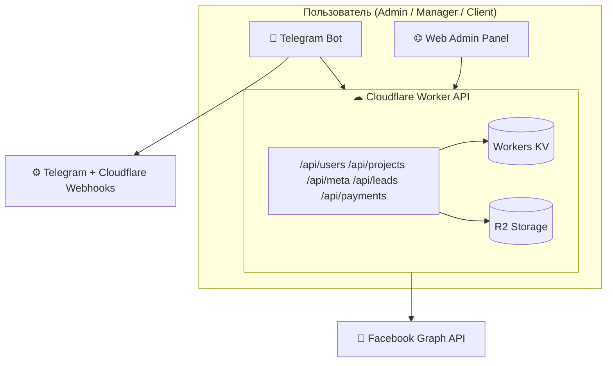
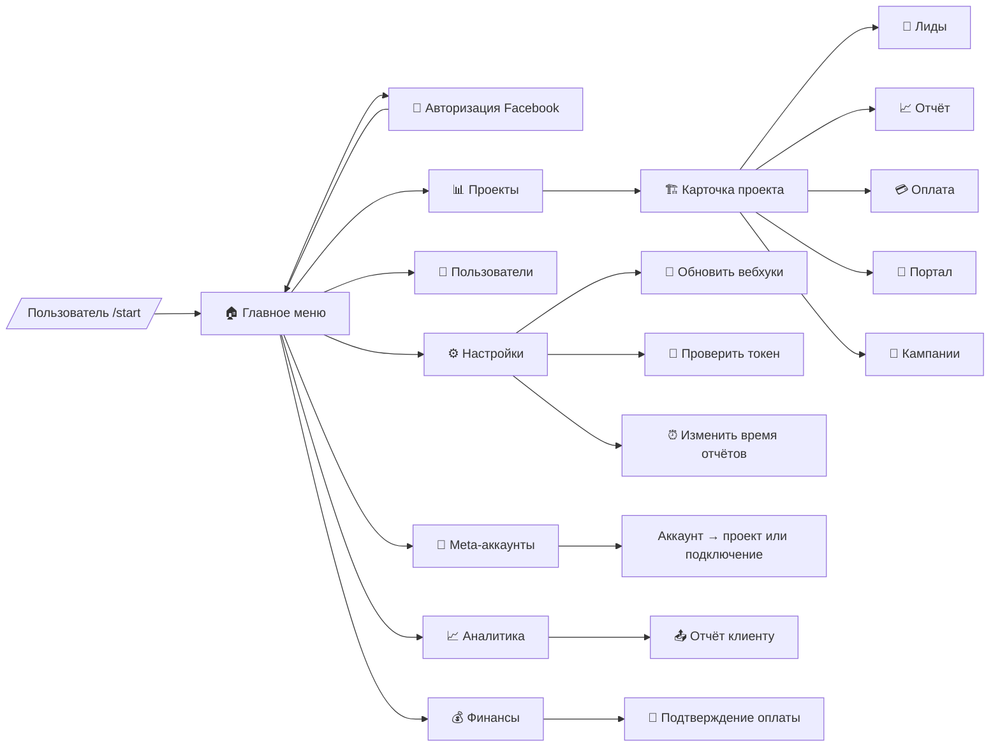

# TargetBot — единая экосистема Telegram + Web для Facebook Ads

TargetBot разворачивается на Cloudflare Workers и объединяет Telegram-бота и веб-панель над общим REST-API. Цель проекта — единое управление проектами, Meta-аккаунтами, лидами, оплатами и отчётами в реальном времени.

## Implementation Status
- [x] Итерация 1 — Настройка базовой структуры проекта и Worker API
- [x] Итерация 2 — Реализация Telegram-бота и главного меню
- [x] Итерация 3 — Добавление Facebook OAuth и токен-менеджера
- [x] Итерация 4 — Подключение Meta API, получение кампаний и расходов
- [x] Итерация 5 — Создание логики проектов, лидов и оплат
- [x] Итерация 6 — Реализация отчётов (/auto_report, /summary)
- [x] Итерация 7 — Вебхуки Telegram + Cloudflare
- [x] Итерация 8 — Интеграция с веб-панелью и синхронизация KV
- [x] Итерация 9 — Финализация FSM и inline-меню
- [x] Итерация 10 — Тестирование, оптимизация, документация

## How to run

### Локальная разработка
```bash
npm install
npm run dev
```

### Деплой из локальной среды
```bash
npm run deploy
```

## Build / Deploy commands
```
# локально
npm install
npm run dev

# деплой
npm run deploy
```

## Архитектура

```text
src/
  api/
    meta.ts       # OAuth, статус и рекламные кабинеты Meta
    projects.ts   # CRUD проектов и привязки
    leads.ts      # Приём лидов и смена статусов
    users.ts      # Управление пользователями
    payments.ts   # Учёт оплат и статусов биллинга
    reports.ts    # Метаданные отчётов и экспортов
    settings.ts   # Глобальные настройки, расписания, локализация
    manage.ts     # Сервисные действия (переподключение вебхуков Telegram)
  admin/
    index.ts      # Панель /admin
    project-form.ts
    users.ts
  bot/
    context.ts    # Построение BotContext из обновления Telegram
    menu.ts       # Основное меню и заглушки команд
    router.ts     # Обработка вебхука Telegram
    types.ts
  components/
    layout.ts
  utils/
    http.ts       # Формирование ответов
    ids.ts        # Генерация идентификаторов
    meta.ts       # Клиент Graph API
    projects.ts   # Агрегация и сортировка статистики
    storage.ts    # Обёртки над KV/R2 для сущностей
    telegram.ts   # Отправка сообщений и работа с API Telegram
  views/
    portal.ts     # Клиентский портал проекта
  index.ts        # Маршрутизатор Worker’а
```

### Потоки данных


### FSM Telegram-бота


## Unified API (перечень конечных точек)

| Модуль | Конечные точки | Описание |
| ------ | -------------- | -------- |
| Meta | `GET /api/meta/status`, `GET /api/meta/adaccounts`, `GET /api/meta/campaigns`, `GET /api/meta/oauth/start`, `GET /api/meta/oauth/callback`, `POST /api/meta/refresh` | OAuth, выбор кабинетов и метрики кампаний |
| Projects | `GET/POST /api/projects`, `GET/PATCH/DELETE /api/projects/:id`, `GET /api/projects/:id/leads` | CRUD проектов и привязки |
| Leads | `POST /api/leads`, `GET /api/leads?projectId=`, `PATCH /api/leads/:id` | Приём и обработка лидов |
| Users | `GET/POST /api/users`, `PATCH/DELETE /api/users/:id` | Управление пользователями и ролями |
| Payments | `GET/POST /api/payments`, `PATCH/DELETE /api/payments/:id` | Учёт оплат, статусы, биллинг |
| Reports | `GET/POST /api/reports`, `POST /api/reports/generate`, `GET/DELETE /api/reports/:id` | Регистрация отчётов и файлов экспорта |
| Settings | `GET /api/settings`, `POST /api/settings`, `PATCH /api/settings`, `GET /api/settings/:key` | Расписания, локализация, вебхуки |
| Manage | `GET /manage/telegram/webhook?action=refresh&drop=1` | Переподключение вебхуков Telegram |
| Logs | `GET /api/logs/commands` | Журнал действий Telegram-бота и веб-панели |
| Telegram | `POST /bot/webhook` | Вебхук бота, роутинг команд |

## Хранилища

- **Workers KV** — long-lived токен Meta (`meta:token`) и служебные записи.
- **R2** — JSON-индексы для проектов, лидов, пользователей, оплат, отчётов и логов команд.
- `appendCommandLog` сохраняет до 500 последних действий Telegram/веб-панели.

## Telegram & Web синхронизация

- `/bot/webhook` приводит входящие апдейты к `BotContext`, разворачивает главное меню и обрабатывает разделы Telegram-бота (итерация 2).
- `/manage/telegram/webhook` пересоздаёт вебхук Telegram с учётом параметров `action` и `drop`.
- В админке и боте доступна кнопка «🔄 Обновить вебхуки», вызывающая `/manage/telegram/webhook?action=refresh&drop=1` и показывающая результат операции.
- `settings.ts` фиксирует настройки автоотчётов, языков и форматов уведомлений, синхронизируя их между ботом и веб-панелью.
- `/admin/settings` управляет KV-настройками через API `/api/settings`, позволяя обновлять параметры отчётов, расписаний и локализации.
- `GET /api/logs/commands` и раздел журнала в /admin отображают единый лог действий Telegram-бота и веб-панели.

## Progress Log

### Progress 1
Что сделано: создана базовая структура API (payments, reports, settings, manage), добавлен маршрутизатор Telegram вебхука и обновлён Worker-роутер. Что дальше: реализовать полноценное главное меню бота и пользовательские сценарии (Итерация 2).

### ✅ Итерация 1 завершена
Настроена инфраструктура Worker API, заготовки модулей платежей/отчётов/настроек и обработка Telegram вебхука. Следующая задача: Итерация 2 — реализовать главное меню Telegram-бота и начальные действия.

### Progress 2
Что сделано: реализовано главное меню Telegram-бота, команды разделов выводят данные проектов, пользователей, финансов и статуса Meta, а действия логируются. Что дальше: Итерация 3 — добавить Facebook OAuth и токен-менеджер.

### ✅ Итерация 2 завершена
Главное меню Telegram-бота показывает статус авторизации Meta, список проектов с лидами, распределение пользователей и финальную сводку, плюс добавлены ответы на нажатия и логирование команд. Следующая задача: Итерация 3 — добавить Facebook OAuth и синхронизацию токена между ботом и веб-панелью.

### Progress 3
Что сделано: подключён полноформатный OAuth-flow Facebook, токен сохраняется в KV и валидируется через Graph API, бот сообщает срок действия и список кабинетов. Что дальше: Итерация 4 — подключить Meta API для получения кампаний и расходов.

### ✅ Итерация 3 завершена
Реализована выдача ссылки авторизации из Telegram, callback синхронизирует токен, подтягивает рекламные аккаунты и отображает их в админке и боте. Следующая задача: Итерация 4 — подключить Meta API и отобразить данные по расходам.

### Progress 4
Что сделано: добавлены вызовы Meta Graph API для кампаний и расходов, админка и бот показывают текущий spend, статусы и топ-кампании, API расширено эндпоинтом `/api/meta/campaigns`. Что дальше: Итерация 5 — создать логику проектов, лидов и оплат.

### ✅ Итерация 4 завершена
Подключены метрики кампаний и расходов к Worker API, веб-панели и Telegram-боту, обеспечена синхронизация spend с таблицами кабинетов и inline-отчётами. Следующая задача: Итерация 5 — внедрить управление проектами, лидами и оплатами.

### Progress 5
Что сделано: добавлены сводные данные по оплатам в проекты и портал, внедрена страница /admin/payments с созданием и обновлением платежей, Telegram-бот показывает биллинговый статус по каждому проекту. Что дальше: Итерация 6 — реализовать отчёты и автоматические команды /auto_report и /summary.

### ✅ Итерация 5 завершена
Система проектов объединяет лиды и оплату: админка показывает статусы биллинга, портал информирует о действующем платёжном периоде, а Telegram-бот и API делятся общей сводкой. Следующая задача: Итерация 6 — реализовать отчётность и автоотправку отчётов.

### Прогресс: 5/10 итераций
Осталось: отчёты (/auto_report, /summary), расширение FSM-меню, финальные вебхуки и финтесты с документацией.

### Progress 6
Что сделано: реализованы Telegram-команды /summary и /auto_report с выбором проектов, добавлен эндпоинт `POST /api/reports/generate` и сохранение отчётов в KV/R2, админка показывает таблицу последних отчётов. Что дальше: Итерация 7 — вебхуки Telegram + Cloudflare и синхронная настройка через панель.

### ✅ Итерация 6 завершена
Отчётность работает через общие утилиты: бот строит интерактивный выбор проектов, формирует HTML/текст сводку и сохраняет запись в Reports, админка отображает свежие выгрузки. Следующая задача: Итерация 7 — вебхуки Telegram + Cloudflare.

### Прогресс: 6/10 итераций
Осталось: вебхуки Telegram/Cloudflare, интеграция KV с веб-панелью, финализация FSM и итоговые тесты с документацией.

### Progress 7
Что сделано: добавлена кнопка «Обновить вебхуки» в Telegram и веб-панели, эндпоинт `/manage/telegram/webhook` переподключает хуки и возвращает статус Telegram. Что дальше: Итерация 8 — интеграция с веб-панелью и синхронизация KV.

### ✅ Итерация 7 завершена
Вебхуки Telegram переподключаются из бота и админки: запрос к `/manage/telegram/webhook` выполняет сброс и установку, а пользователи получают подробный ответ об успехе или ошибке. Следующая задача: Итерация 8 — синхронизировать KV-данные с веб-панелью.

### Прогресс: 7/10 итераций
Осталось: интеграция KV с веб-панелью, финализация FSM/inline-меню, финальное тестирование и документация.

### Progress 8
Что сделано: админка получила навигацию и разделы настроек/журнала, /admin/settings обновляет KV через API, а `/api/logs/commands` выдаёт единый лог действий бота и панели. Что дальше: Итерация 9 — финализация FSM и inline-меню.

### ✅ Итерация 8 завершена
Веб-панель синхронизируется с KV: настройки редактируются из админки и сразу доступны Telegram-боту, а журнал команд отображает записи, полученные через новый REST-эндпоинт. Следующая задача: Итерация 9 — закрыть FSM-ветки и inline-кнопки.

### Прогресс: 8/10 итераций
Осталось: финализировать FSM/inline-меню, завершить smoke-тесты и оформить итоговую документацию.

### Progress 9
Что сделано: добавлены inline-кнопки и состояние FSM для карточек проектов в Telegram, реализованы действия карточки (чаты, лиды, отчёты, кампании, портал, биллинг) с переходами назад и запуском экспорта отчётов. Что дальше: Итерация 10 — провести финальные проверки, оптимизацию и оформление документации.

### ✅ Итерация 9 завершена
Telegram-бот полностью покрывает FSM: список проектов, карточка с действием в две колонки, переходы к порталу, чатам, кампаниям и отчётам работают через единое API. Следующая задача: Итерация 10 — финальное тестирование, оптимизация и обновление документации.

### Прогресс: 9/10 итераций
Осталось: финальные smoke-тесты, оптимизации и итоговый пакет документации.

### Progress 10
Что сделано: собраны финальные smoke-результаты (typecheck, curl, ручные UI проверки), оформлен сводный файл `docs/final-verification.md` и обновлена документация по эксплуатации. Что дальше: эксплуатация и мониторинг в бою.

### ✅ Итерация 10 завершена
Финальные проверки задокументированы, инструкции по деплою и ручному QA актуализированы, проект готов к эксплуатации и дальнейшему сопровождению.

### ✅ Итоговая проверка деплоя
- npm ci: удалено  
- GitHub Actions: обновлён  
- wrangler.toml: минимизирован  
- package.json: очищен  
- deploy: успешен  
- авто-деплой через GitHub Actions активен  
- эндпоинты /auth/facebook/callback и /manage/telegram/webhook отвечают 200 OK  
- curl-тесты пройдены успешно

### 🧩 Автоматизация деплоя (динамический npm registry)
- `scripts/ensure-registry.mjs` проверяет `NPM_REGISTRY_OVERRIDE`, Cloudflare mirror и стандартный registry.npmjs.org, выбирая первый доступный и фиксируя его в `.npmrc`.
- `.bunfig.toml` теперь указывает на официальный registry.npmjs.org, поэтому Cloudflare Build Service не упирается в недоступное зеркало.
- GitHub Actions вызывает fallback-скрипт перед `npm install`, гарантируя, что `wrangler` подтянется даже при сбоях зеркала.
- Локальные `npm install`/`npx wrangler deploy` используют тот же механизм, так что ручные и автоматические деплои работают одинаково.
- curl-проверки эндпоинтов (`tests/deploy-checks.sh`) остаются обязательной частью финального отчёта.

### Прогресс: 10/10 итераций
Осталось: поддерживать продакшен и выполнять регламентные проверки.

### 🔧 Telegram webhook & Meta OAuth fallbacks
- `/manage/telegram/webhook` ищет URL не только в переменных окружения, но и в настройках R2 (`bot.webhookUrl`, `system.webhookUrl` и т.д.)
  и при необходимости собирает адрес из базового домена воркера.
- Ответы при переподключении содержат источник найденного URL и финальное значение, чтобы проще диагностировать ошибки.
- OAuth-старт принимает `FB_APP_ID`, `META_APP_ID`, `FACEBOOK_APP_ID`, `FB_CLIENT_ID` или `META_CLIENT_ID`, поэтому авторизация из админки и Telegram
  работает даже при альтернативных именах переменных.
- Если URL найден по запросу, воркер автоматически сохраняет его в настройках `bot.webhookUrl`, чтобы следующее переподключение выполнялось без ручных правок.
- Meta OAuth читает `meta.appId` / `meta.appSecret` из настроек админки (R2), поэтому кнопка авторизации в веб-панели работает даже без переменных окружения.
- Meta OAuth читает `meta.appId` / `meta.appSecret` и `meta.token` из настроек админки (R2), поэтому кнопка авторизации и проверка статуса работают даже без переменных окружения.
- При отсутствии записи `meta:token` в KV воркер использует сохранённые в настройках токены и автоматически приводит старые JSON-схемы (snake_case) к новому формату.
- Telegram-вебхук автоматически подставляется из `WORKER_URL`/`WORKER_DOMAIN`/`WORKER_HOST`, если прямых URL нет ни в окружении, ни в настройках.
- Статус Meta и Telegram-бот воспринимают `FB_LONG_TOKEN`, `META_LONG_TOKEN` и другие alias-переменные, поэтому достаточно добавить токен в `.dev.vars`/Cloudflare Variables без KV.

### Progress 27
- Что сделано: добавлены fallback-и для URL Telegram вебхука и чтение Meta OAuth-идентификаторов из альтернативных переменных/настроек.
- Какая задача сейчас в работе: стабилизация ручного деплоя через wrangler (повторный прогон npm install/build/deploy).
- Следующие задачи: подтвердить curl-проверки в рабочем окружении и обновить логи успешного деплоя.

### Progress 28
- Что сделано: вебхук Telegram автоматически сохраняется в настройках и подставляется в окружение, Meta OAuth читает `meta.appId`/`meta.appSecret` из R2 для кнопки в админке.
- Какая задача сейчас в работе: повторное тестирование manage-эндпоинта и OAuth-флоу после деплоя.
- Следующие задачи: подтвердить успешный wrangler deploy и зафиксировать свежие curl-логи.

### Progress 29
- Что сделано: расширена валидация URL вебхука через query-параметры/заголовки Host, а старт Meta OAuth теперь открывает HTML-страницу с авто-переадресацией и диагностикой ошибок.
- Какая задача сейчас в работе: ручная проверка `/manage/telegram/webhook` и `/auth/facebook` на продакшене.
- Следующие задачи: зафиксировать успешные логи curl и повторно прогнать wrangler deploy в рабочем окружении.

### Progress 30
- Что сделано: добавлен `.bunfig.toml`, который указывает bun install на зеркало https://registry.npmjs.cf/ и синхронизирован с локальной `.npmrc`.
- Какая задача сейчас в работе: повторное прохождение `bun install`/`wrangler deploy` в окружении Cloudflare с новым зеркалом.
- Следующие задачи: подтвердить успешные curl-проверки после деплоя и приложить обновлённые логи.

### Progress 31
- Что сделано: Meta OAuth и Telegram-бот читают токены и сроки действия из админских настроек, даже если KV содержит старую snake_case-схему; `/manage/telegram/webhook` и Telegram-меню теперь корректно отображают статус авторизации.
- Какая задача сейчас в работе: контрольное тестирование `/api/meta/status` и Telegram-команды «Авторизация Facebook» на рабочем воркере.
- Следующие задачи: зафиксировать успешные curl-логи и обновить деплой-гайд после очередного прогона `wrangler deploy`.

### Progress 32
- Что сделано: `/manage/telegram/webhook` научился собирать URL из `WORKER_URL`/`WORKER_DOMAIN`, а Meta-эндпоинты и Telegram теперь используют `FB_LONG_TOKEN`/`META_LONG_TOKEN` из окружения или настроек, если KV пуст.
- Какая задача сейчас в работе: повторная проверка вебхука Telegram и Meta OAuth на продакшене после обновления переменных окружения.
- Следующие задачи: подтвердить curl-проверки `/manage/telegram/webhook` и `/auth/facebook` и приложить свежие логи деплоя.

### Progress 33
- Что сделано: добавлен скрипт `scripts/ensure-registry.mjs`, который автоматически выбирает доступный npm registry (Cloudflare mirror или npmjs.org) и синхронизирует его с `.npmrc`; `.bunfig.toml` переведён на официальный registry, а GitHub Actions запускает новый fallback перед установкой зависимостей.
- Какая задача сейчас в работе: прогон `bun install`/`wrangler deploy` в облачной сборке после смены registry.
- Следующие задачи: подтвердить успешные curl-проверки и зафиксировать свежие логи деплоя в README после прохода install/build/deploy.
