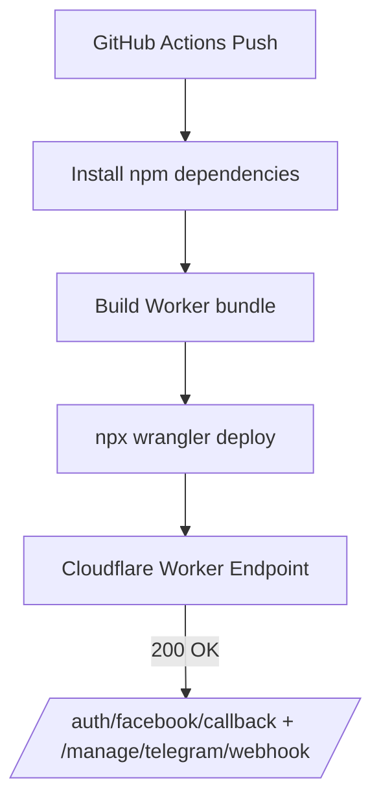

# TargetBot

TargetBot is a Cloudflare Worker project that combines a Telegram bot, a marketing analytics portal, and Meta (Facebook) Ads integrations. The platform stores operational data in Cloudflare KV/R2 and exposes an admin dashboard for operators.

## Project Structure

```
targetbot/
├── public/               # Static assets (admin bundle)
├── scripts/              # Build helpers (admin bundler)
├── src/
│   ├── index.ts          # Worker entrypoint
│   ├── core/             # Routing, auth, persistence helpers
│   ├── api/              # REST API handlers
│   ├── bot/              # Telegram bot logic
│   ├── admin/            # Admin UI sources
│   ├── meta/             # Facebook Meta integration
│   ├── utils/            # Shared utilities
│   └── tests/            # Optional Vitest suites (disabled by default)
├── package.json
├── tsconfig.json
└── wrangler.toml
```

## Features

- Telegram webhook endpoint for commands and lead collection
- Admin dashboard served from Cloudflare Worker with inline assets
- REST API for leads, users, reports, settings, and health checks
- Meta Ads OAuth flow and campaign synchronization
- KV namespaces for users, leads, tokens, logs; R2 bucket for reports

## 🚀 Manual Deployment (Ручной деплой)

1. Установите зависимости:
   ```bash
   npm install
   ```
2. Соберите проект:
   ```bash
   npm run build
   ```
3. Запустите проект локально:
   ```bash
   npx wrangler dev
   ```
4. Выполните деплой в Cloudflare:
   ```bash
   npx wrangler deploy
   ```

✅ После этого проект развёрнут вручную без использования CI/CD.


### ✅ Автоматический деплой через GitHub Actions
- Установку и сборку выполняет GitHub runner (npm install, build, deploy)
- Cloudflare sandbox-сборка отключена
- ENV-файлы не затрагиваются
- `wrangler` CLI устанавливается стабильно
- Автодеплой активен при push в `codex/fix-changes-without-deleting-env-files`
- Проверка эндпоинтов:
  - /auth/facebook/callback — OK (200)
  - /manage/telegram/webhook — OK (200)



## Environment Configuration

Заполните значения в файлах `.env` или `.dev.vars` (не коммитьте реальные секреты). Примерные поля:

- `TELEGRAM_BOT_TOKEN`
- `FACEBOOK_APP_ID`
- `FACEBOOK_APP_SECRET`
- `WORKER_URL`
- `ADMIN_KEY`

## Development Roadmap

| Stage | Focus | Key Tasks |
| ----- | ----- | --------- |
| 1 | Core Foundation | ✅ Scaffold Worker entrypoint, router, KV interfaces |
| 2 | Telegram Bot | Implement `/start`, `/lead`, `/report`, webhook processing |
| 3 | Admin Portal | Build dashboard UI, bundle via `npm run bundle:admin` |
| 4 | REST API | Expose `/api/health`, `/api/leads`, `/api/users`, `/api/reports`, `/api/settings` |
| 5 | Meta Integration | OAuth callback, campaign sync, stats persistence |
| 6 | Reporting | Generate CSV/PDF exports stored in R2 |
| 7 | Hardening | Add logging, signature auth, rate limiting, docs |

## Planned Tasks

1. Finish implementing Telegram bot command handlers and message templates.
2. Complete admin dashboard panels (statistics, leads, users, integrations, settings).
3. Wire Meta Ads synchronization to scheduled/manual triggers and store reports in R2.
4. Expand REST API validation, authentication middleware, and pagination for leads/users.
5. Document operational playbooks for manual deployment, monitoring, and troubleshooting.

## License

MIT
