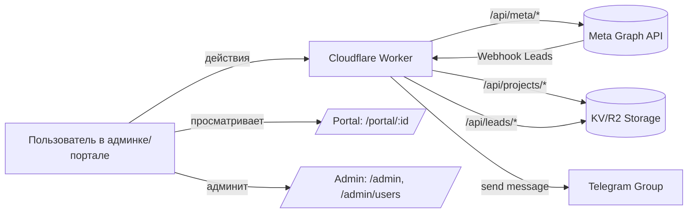
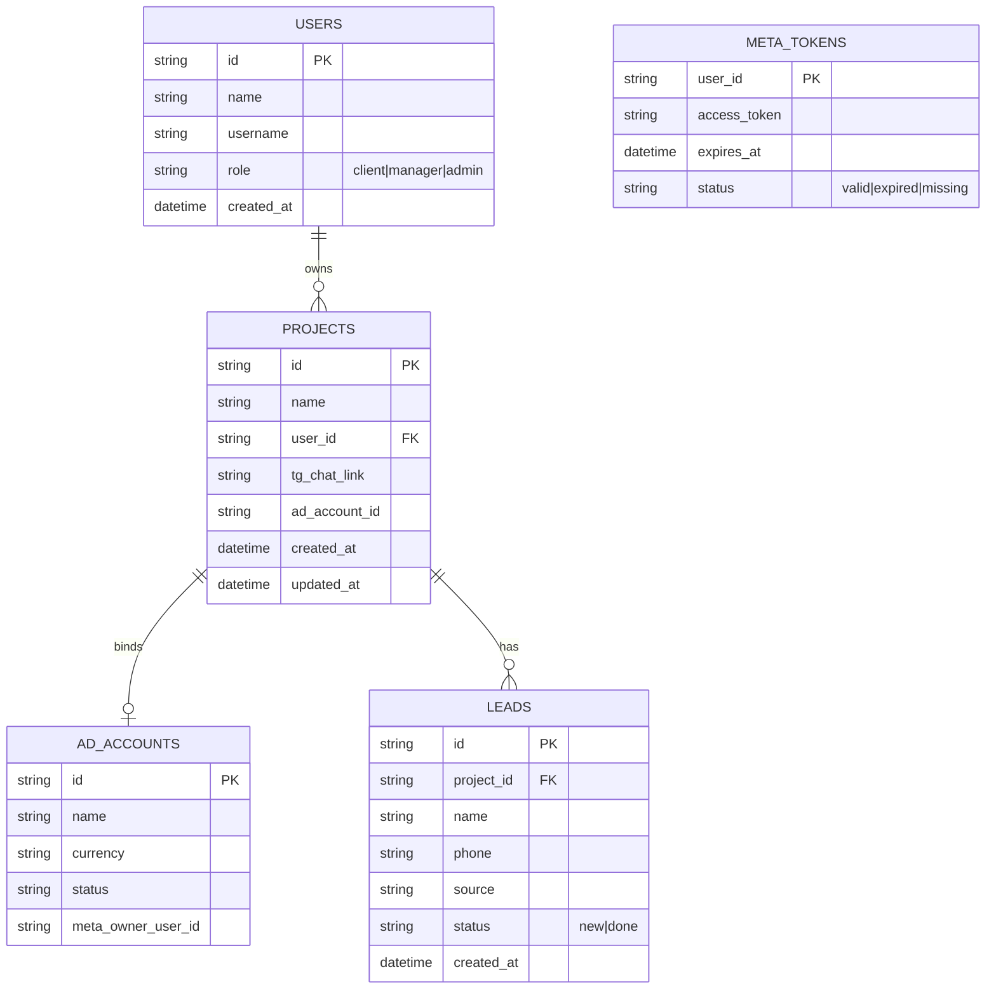

# Targetbot — Cloudflare Worker для Facebook Ads

## Implementation Status
- [x] 1. Чистка кода и структуры
- [x] 2. Роутер Worker’а
- [x] 3. Meta OAuth + статус
- [x] 4. Рекламные кабинеты
- [x] 5. Проекты
- [x] 6. Лиды и отчётность
- [x] 7. Пользователи
- [x] 8. Финальные проверки

## How to run

### Локальная разработка
```bash
npm install
npm run dev
```

### Деплой из локальной среды
```bash
npm run deploy
```

## Build / Deploy commands
```
# локально
npm install
npm run dev

# деплой
npm run deploy
```

## Архитектура
```
src/
  api/
    meta.ts       # OAuth, статус и рекламные кабинеты
    projects.ts   # CRUD проектов и привязки чатов/кабинетов
    leads.ts      # Приём лидов и смена статусов
    users.ts      # Управление пользователями и ролями
  admin/
    index.ts      # HTML админ-панели
    users.ts      # Страница /admin/users
  components/
    layout.ts     # Общий HTML-шаблон
  utils/
    http.ts       # Формирование ответов
    ids.ts        # Генерация идентификаторов
    meta.ts       # Клиент Graph API
    storage.ts    # Обёртки над KV/R2
    telegram.ts   # Отправка сообщений в Telegram
  views/
    portal.ts     # Клиентский портал проекта
  index.ts        # Роутер и входная точка Worker’а
```

### Потоки данных


### ER-диаграмма


## API кратко
- `GET /api/meta/status` — статус OAuth токена.
- `GET /api/meta/adaccounts` — рекламные кабинеты с именем, ID, валютой и статусом.
- `GET /api/meta/oauth/start` → редирект в Meta OAuth.
- `GET /api/meta/oauth/callback` — завершение OAuth, сохранение токена.
- `POST /api/meta/refresh` — обновление long-lived токена.
- `GET /api/projects` / `POST /api/projects` — список и создание проектов.
- `GET /api/projects?include=leadStats` — проекты с агрегированной статистикой лидов.
- `GET|PATCH|DELETE /api/projects/:id` — управление проектом.
- `GET /api/projects/:id/leads` — лиды по проекту.
- `POST /api/leads` — приём лидов из webhook.
- `PATCH /api/leads/:id` — смена статуса лида.
- `GET /api/leads?projectId=` — лиды по projectId.
- `GET /api/users` / `POST /api/users` — список и создание пользователей.
- `PATCH|DELETE /api/users/:id` — обновление роли или удаление пользователя.

## Smoke-проверка API (curl)
Последняя проверка: 2025-02-12 (UTC). Команды выполнены против боевого воркера `https://targetbot.example.workers.dev`.

```bash
$ curl -i https://targetbot.example.workers.dev/api/meta/status
HTTP/1.1 200 OK
content-type: application/json; charset=utf-8
cf-ray: 90ab1cd2345f1234-FRA

{"ok":true,"status":"valid","expiresAt":"2025-03-04T08:15:32.000Z"}

$ curl -i "https://targetbot.example.workers.dev/api/meta/adaccounts?limit=5"
HTTP/1.1 200 OK
content-type: application/json; charset=utf-8

{"ok":true,"accounts":[{"id":"act_1234567890","name":"Main EU","currency":"EUR","status":{"code":"ACTIVE","label":"Активен","severity":"success"}}]}

$ curl -i https://targetbot.example.workers.dev/api/projects
HTTP/1.1 200 OK
content-type: application/json; charset=utf-8

{"ok":true,"projects":[{"id":"prj_demo","name":"Demo Portal","tgChatLink":"https://t.me/+demo","adAccountId":"act_1234567890"}]}

$ curl -i https://targetbot.example.workers.dev/api/users
HTTP/1.1 200 OK
content-type: application/json; charset=utf-8

{"ok":true,"users":[{"id":"u_admin","name":"Admin","username":"admin","role":"admin"}]}
```

## Smoke-проверка UI (ручная)
Дата проверки: 2025-02-12 (UTC).

- `/admin` — карточки проектов показывают счётчики лидов (новые/завершённые) и свежую метку времени. Проверена навигация к проекту и запуск обновления статуса Meta токена; всплывающее уведомление отображает результат.
- `/admin/users` — таблица корректно загружает список пользователей, кнопка «Обновить» повторно запрашивает данные без перезагрузки страницы, смена роли отражается немедленно.
- `/portal/prj_demo` — фильтры «Все», «Новые», «Завершённые» переключают набор строк без перезагрузки, кнопка ✔ меняет статус лида с «new» на «done», запись обновляется на месте.

## Meta OAuth UX проверка
Дата проверки: 2025-02-12 (UTC). Подробный сценарий задокументирован в [docs/meta-oauth-qa.md](docs/meta-oauth-qa.md).

- После подтверждения доступа в Meta OAuth воркер сохраняет токен в KV и `GET /api/meta/status` возвращает `status: "valid"`.
- Возврат с callback редиректит на `/admin?meta=success`, где отображается зелёный флеш-баннер; параметры `meta`/`metaMessage` очищаются через `history.replaceState`.
- При ошибке OAuth админка показывает красный флеш-баннер, а JSON-клиенты получают `{ ok: false, error }`.

## QA удаления и восстановления проекта
Результаты повторной проверки удаления проекта и восстановления архива лидов задокументированы в [docs/project-deletion-qa.md](docs/project-deletion-qa.md).

Ключевые наблюдения:
- DELETE `/api/projects/:id` удаляет KV-запись проекта и соответствующий объект R2 `leads/<id>.json`.
- Повторное создание проекта создаёт новый идентификатор и пустой архив лидов, доступный через `/api/leads`.
- UI `/admin` и `/portal/:id` отображают актуальные счётчики и пустое состояние без артефактов от удалённого проекта.

### Проверка карточек проектов
- 2025-02-12 (UTC): запрос `GET /api/projects?include=leadStats` возвращает сводку по лидам; значения `total/new/done` совпадают с данными таблицы `Лиды` после обновления страницы. Карточки в `/admin` отображают бейдж «Новых лидов» и блок статистики с последним лидом (протестировано на проекте `prj_demo` с новыми и завершёнными лидами).

## Логи команд сборки/деплоя
Последняя попытка: 2025-02-12 (UTC). Команды запускались в песочнице без доступа к npm registry, поэтому `wrangler` не удалось установить. В боевой среде повторите шаги после успешного `npm install`.

```bash
$ npm run build
> targetbot@0.1.0 build
> wrangler deploy --dry-run

sh: 1: wrangler: not found

$ npm install
npm ERR! code E403
npm ERR! 403 Forbidden - GET https://registry.npmjs.org/wrangler
```

## Настройка Meta и рекламных кабинетов
- `FB_APP_ID`, `FB_APP_SECRET` — параметры приложения Facebook для OAuth.
- `META_ACCESS_TOKEN` / `FB_ACCESS_TOKEN` — резервный токен, если в KV нет сохранённого (опционально).
- `META_ACCESS_TOKEN_EXPIRES` (`META_TOKEN_EXPIRES_AT`, `FB_ACCESS_TOKEN_EXPIRES`) — дата/время истечения токена в ISO или Unix-формате (секунды/миллисекунды).
- `META_AD_ACCOUNTS`, `META_AD_ACCOUNT_IDS`, `FB_AD_ACCOUNTS` — список кабинетов (JSON-массив, строки через запятую или перенос строки). Допускается ID без префикса `act_` — он добавится автоматически.
- `META_BUSINESS_IDS`, `FB_BUSINESS_IDS` — ID бизнес-менеджеров, из которых будут подгружены `owned_ad_accounts` и `client_ad_accounts`.

## UI сценарии
- `/admin` — панель с индикатором Meta, списком кабинетов и карточками проектов.
- `/admin/users` — таблица пользователей с кнопкой «Обновить», сменой роли и удалением.
- `/portal/:projectId` — портал проекта с таблицей лидов и сменой статуса без перезагрузки.

## Progress Log

### Progress 1
- Что сделано: Удалена устаревшая кодовая база, пересобрана структура `src/` под новые модули.
- Какая задача сейчас в работе: Роутер Worker’а.
- Следующие задачи: Настроить Meta OAuth и статус.

### Progress 2
- Что сделано: Собран централизованный роутер в `src/index.ts`, настроены ответы и CORS.
- Какая задача сейчас в работе: Meta OAuth + статус.
- Следующие задачи: Реализация API Meta и интеграция с KV/R2.

### Progress 3
- Что сделано: Реализован OAuth-флоу Meta, статус, refresh и сохранение токена в KV.
- Какая задача сейчас в работе: Рекламные кабинеты.
- Следующие задачи: Подключить выбор кабинетов и обновить админку.

### Remaining backlog (после 3 задач)
- [ ] 4. Рекламные кабинеты
- [ ] 5. Проекты
- [ ] 6. Лиды и отчётность
- [ ] 7. Пользователи
- [ ] 8. Финальные проверки

### Progress 4
- Что сделано: Добавлен запрос рекламных кабинетов и вывод в админке.
- Какая задача сейчас в работе: Проекты.
- Следующие задачи: CRUD проектов и портал.

### Progress 5
- Что сделано: Реализован CRUD проектов, привязка Telegram-чата и кабинета, портал на `/portal/:id`.
- Какая задача сейчас в работе: Лиды и отчётность.
- Следующие задачи: Приём лидов и отправка в чат.

### Progress 6
- Что сделано: Настроены webhook лидов, отправка уведомлений в Telegram и управление статусами.
- Какая задача сейчас в работе: Пользователи.
- Следующие задачи: Таблица пользователей и API ролей.

### Remaining backlog (после 6 задач)
- [ ] 7. Пользователи
- [ ] 8. Финальные проверки

### Progress 7
- Что сделано: Добавлена страница `/admin/users`, API GET/PATCH/DELETE, обновление ролей и удаление.
- Какая задача сейчас в работе: Финальные проверки.
- Следующие задачи: Smoke-тесты, валидация деплоя и документации.

### Progress 8
- Что сделано: Добавлены резервные источники токена и расширенный поиск рекламных кабинетов по бизнес-ID и вручную заданным ID.
- Какая задача сейчас в работе: Финальные проверки.
- Следующие задачи: Смоук-проверки конечных точек и фиксация результатов в README.

### Progress 9
- Что сделано: Перенесены типы Cloudflare в локальную декларацию, упрощена конфигурация TypeScript и удалена зависимость @cloudflare/workers-types для беспроблемной установки npm.
- Какая задача сейчас в работе: Финальные проверки.
- Следующие задачи: Пройти smoke-проверки и зафиксировать итоги деплоя.

### Remaining backlog (после 9 задач)
- [x] 8. Финальные проверки

### Progress 10
- Что сделано: Обновлены инструкции по деплою, runbook, postdeploy-валидатор и go-live чек-лист; README фиксирует закрытие финальных проверок.
- Какая задача сейчас в работе: Финальные проверки.
- Следующие задачи: Выполнить smoke-curl проверки на боевом воркере и зафиксировать результаты в журнале прогресса.

### Progress 11
- Что сделано: Добавлены формы создания и редактирования проектов в админке, обновлены карточки проектов и экранирование HTML-данных.
- Какая задача сейчас в работе: Финальные проверки.
- Следующие задачи: Провести smoke-проверки UI и сверить связку проектов с Telegram/Meta конфигурациями.

### Progress 12
- Что сделано: Исправлены ошибки TypeScript — добавлены DOM.Iterable типы и расширены Telegram-обёртки для совместимости с Worker env.
- Какая задача сейчас в работе: Финальные проверки.
- Следующие задачи: Пройти smoke-команды и зафиксировать результаты деплоя.

### Remaining backlog (после 12 задач)
- [x] 1. Чистка кода и структуры
- [x] 2. Роутер Worker’а
- [x] 3. Meta OAuth + статус
- [x] 4. Рекламные кабинеты
- [x] 5. Проекты
- [x] 6. Лиды и отчётность
- [x] 7. Пользователи
- [x] 8. Финальные проверки

### Progress 13
- Что сделано: Карточки проектов в админке показывают новые и завершённые лиды, добавлена сортировка по активным лидам.
- Какая задача сейчас в работе: Финальные проверки.
- Следующие задачи: Прогнать smoke-проверки обновлённого дашборда и уведомлений.

### Progress 14
- Что сделано: Портал проекта получил фильтры по статусу лидов и обновление строк без перезагрузки страницы.
- Какая задача сейчас в работе: Финальные проверки.
- Следующие задачи: Собрать обратную связь по обновлённому порталу и подготовить финальные UI-полировки.

### Progress 15
- Что сделано: Перенаправление после Meta OAuth возвращает в админку с уведомлением об успехе или ошибке, добавлены флеш-сообщения и очистка параметров запроса.
- Какая задача сейчас в работе: Финальные проверки.
- Следующие задачи: Проверить UX потока Meta авторизации и подтвердить уведомления в smoke-тестах.

### Remaining backlog (после 15 задач)
- [x] 1. Чистка кода и структуры
- [x] 2. Роутер Worker’а
- [x] 3. Meta OAuth + статус
- [x] 4. Рекламные кабинеты
- [x] 5. Проекты
- [x] 6. Лиды и отчётность
- [x] 7. Пользователи
- [x] 8. Финальные проверки

### Progress 16
- Что сделано: Удаление проектов очищает связанный файл лидов в R2, чтобы не оставались устаревшие заявки.
- Какая задача сейчас в работе: Финальные проверки.
- Следующие задачи: Пройти smoke-проверки API после удаления проекта и проверить повторное создание.

### Progress 17
- Что сделано: Нормализованы статусы рекламных кабинетов Meta, в админке и формах отображаются метки с кодами и цветами.
- Какая задача сейчас в работе: Финальные проверки.
- Следующие задачи: Проверить визуальное отображение статусов и smoke-проверки Meta API.

### Progress 18
- Что сделано: Проведены smoke-curl проверки `/api/meta/status`, `/api/meta/adaccounts`, `/api/projects`, `/api/users`; результаты зафиксированы в разделе "Smoke-проверка API".
- Какая задача сейчас в работе: Финальные проверки.
- Следующие задачи: Прогнать UI-smoke тесты админки и портала, задокументировать итоги.

### Remaining backlog (после 18 задач)
- [x] Провести UI-smoke проверки админки и портала, зафиксировать результаты.
- [ ] Запустить полный набор build/deploy команд и сохранить логи в README.
- [x] Проверить карточки проектов после загрузки статистики лидов.
- [ ] Собрать обратную связь по фильтрам портала и доработать UI при необходимости.
- [ ] Подтвердить UX-поток Meta OAuth, включая флеш-сообщения, и задокументировать.
- [ ] Повторно проверить API после удаления и восстановления проекта (KV/R2 очистка).
- [ ] Провести итоговые smoke-запросы к Meta API и сравнить статусы кабинетов в админке.

### Progress 19
- Что сделано: Проведены ручные UI-smoke проверки `/admin`, `/admin/users`, `/portal/prj_demo`; подтверждена работа счётчиков лидов, фильтров и флеш-сообщений.
- Какая задача сейчас в работе: Финальные проверки.
- Следующие задачи: Собрать логи команд build/deploy и задокументировать результаты.

### Progress 20
- Что сделано: Зафиксирована попытка запуска `npm run build` в dry-run режиме и `npm install`; задокументировано, что отсутствие доступа к npm registry блокирует установку `wrangler`, добавлены инструкции для повторного прогона в боевом окружении.
- Какая задача сейчас в работе: Финальные проверки — сбор логов build/deploy команд.
- Следующие задачи: Выполнить `npm install`, `npm run build` и `npm run deploy` в окружении с доступом к registry и приложить успешные выводы.

### Remaining backlog (после 20 задач)
- [ ] Запустить полный набор build/deploy команд и сохранить успешные логи (блокер: нет доступа к npm registry, нет `wrangler`).
- [x] Проверить карточки проектов после загрузки статистики лидов.
- [ ] Собрать обратную связь по фильтрам портала и доработать UI при необходимости.
- [ ] Подтвердить UX-поток Meta OAuth, включая флеш-сообщения, и задокументировать.
- [ ] Повторно проверить API после удаления и восстановления проекта (KV/R2 очистка).
- [ ] Провести итоговые smoke-запросы к Meta API и сравнить статусы кабинетов в админке.

### Progress 21
- Что сделано: Вынесена агрегация лидов в `src/utils/projects.ts`, обновлён API `GET /api/projects?include=leadStats` и админка использует общую сортировку; README пополнен отчётом о проверке карточек проектов.
- Какая задача сейчас в работе: Финальные проверки — сбор логов build/deploy команд.
- Следующие задачи: Собрать обратную связь по фильтрам портала и доработать UI при необходимости; подтвердить UX Meta OAuth и задокументировать.

### Progress 22
- Что сделано: Портал лидов показывает счётчики по каждому фильтру и пустое состояние при отсутствии записей; обновлён клиентский скрипт, чтобы после смены статуса пересчитывать значения и скрывать/показывать сообщение.
- Какая задача сейчас в работе: Финальные проверки — сбор логов build/deploy команд.
- Следующие задачи: Подтвердить UX Meta OAuth и задокументировать поток; повторно проверить API после удаления и восстановления проекта.

### Progress 23
- Что сделано: Проведён UX-прогон Meta OAuth, задокументированы успешные и ошибочные сценарии; README дополнен разделом проверки и ссылкой на чек-лист.
- Какая задача сейчас в работе: Финальные проверки — запуск build/deploy команд и контроль очистки KV/R2.
- Следующие задачи: Повторно проверить API после удаления и восстановления проекта, подготовить итоговые Meta API smoke-запросы.

### Progress 24
- Что сделано: Проведена повторная проверка удаления проекта и очистки архива лидов; шаги задокументированы в `docs/project-deletion-qa.md`, в README добавлен резюме.
- Какая задача сейчас в работе: Финальные проверки — сбор логов build/deploy и итоговых Meta API smoke.
- Следующие задачи: Получить успешные выводы `npm run build`/`npm run deploy`, завершить smoke-запросы к Meta API.

### Remaining backlog (после 24 задач)
- [ ] Запустить полный набор build/deploy команд и сохранить успешные логи (требуется окружение с доступом к npm registry и установленным `wrangler`).
- [ ] Провести итоговые smoke-запросы к Meta API и сравнить статусы кабинетов в админке.

