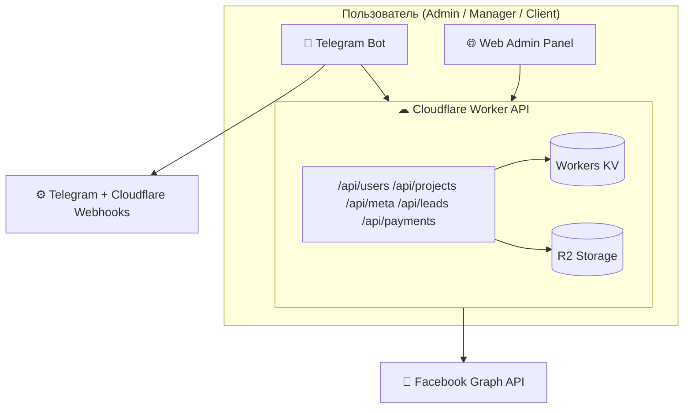
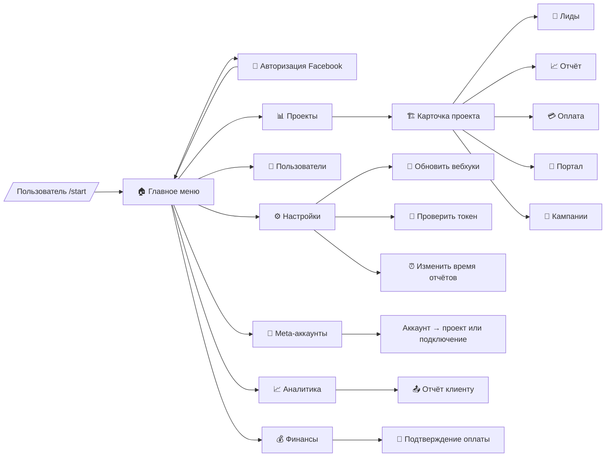

# TargetBot — единая экосистема Telegram + Web для Facebook Ads

TargetBot разворачивается на Cloudflare Workers и объединяет Telegram-бота и веб-панель над общим REST-API. Цель проекта — единое управление проектами, Meta-аккаунтами, лидами, оплатами и отчётами в реальном времени.

## Implementation Status
- [x] Итерация 1 — Настройка базовой структуры проекта и Worker API
- [x] Итерация 2 — Реализация Telegram-бота и главного меню
- [x] Итерация 3 — Добавление Facebook OAuth и токен-менеджера
- [x] Итерация 4 — Подключение Meta API, получение кампаний и расходов
- [x] Итерация 5 — Создание логики проектов, лидов и оплат
- [x] Итерация 6 — Реализация отчётов (/auto_report, /summary)
- [x] Итерация 7 — Вебхуки Telegram + Cloudflare
- [x] Итерация 8 — Интеграция с веб-панелью и синхронизация KV
- [x] Итерация 9 — Финализация FSM и inline-меню
- [x] Итерация 10 — Тестирование, оптимизация, документация

## How to run

### Локальная разработка
```bash
npm install
npm run dev
```

### Деплой из локальной среды
```bash
npm run deploy
```

## Build / Deploy commands
```
# локально
npm install
npm run dev

# деплой
npm run deploy
```

## QA & Regression

```bash
npm run qa
```

Команда выполняет регрессионные проверки расписаний отчётов и напоминаний, фиксирует результат в журнале `QA_RUNS` (KV + R2) и
обновляет расчётные `nextRunAt` для просроченных расписаний.

## Архитектура

```text
src/
  api/
    meta.ts       # OAuth, статус и рекламные кабинеты Meta
    projects.ts   # CRUD проектов и привязки
    leads.ts      # Приём лидов и смена статусов
    users.ts      # Управление пользователями
    payments.ts   # Учёт оплат и статусов биллинга
    reports.ts    # Метаданные отчётов и экспортов
    settings.ts   # Глобальные настройки, расписания, локализация
    manage.ts     # Сервисные действия (переподключение вебхуков Telegram)
  admin/
    index.ts      # Панель /admin
    project-form.ts
    users.ts
  bot/
    context.ts    # Построение BotContext из обновления Telegram
    menu.ts       # Основное меню и заглушки команд
    router.ts     # Обработка вебхука Telegram
    types.ts
  components/
    layout.ts
  utils/
    http.ts       # Формирование ответов
    ids.ts        # Генерация идентификаторов
    meta.ts       # Клиент Graph API
    projects.ts   # Агрегация и сортировка статистики
    storage.ts    # Обёртки над KV/R2 для сущностей
    telegram.ts   # Отправка сообщений и работа с API Telegram
  views/
    portal.ts     # Клиентский портал проекта
  index.ts        # Маршрутизатор Worker’а
```

### Потоки данных


### FSM Telegram-бота


## Iteration Progress

- Выполнено: STEP 17 (итерация 1) — обновлены модель проекта и бот: `ProjectRecord` хранит `billingEnabled/billingPlan/billingAmountUsd`, KV синхронизирует новые поля, а раздел «💰 Оплата» использует callbacks `payments:*` с рабочими кнопками +30 дней/350$/500$/ввод даты и автосохранением состояния.
- Осталось: реализовать сценарии напоминаний/подтверждений оплаты, маршрутизацию в тему чата и cron-автоматику согласно STEP 17.
- Итераций до полного покрытия ТЗ: ≈2 (финализация оплаты + напоминаний, затем smoke/QA).

### Текущее состояние задач

**Выполнено в этой итерации**
- Расширена `ProjectRecord`/KV: добавлены `billingEnabled`, `billingPlan`, `billingAmountUsd`, миграция и merge/normalize логика синхронизируют данные с тарифом и датой оплаты.
- Телеграм-кнопки оплаты переведены на `payments:add_30_days|set_plan_{350,500}|ask_date_*`; обработчики обновляют KV, очищают напоминания и моментально перерисовывают экран.
- `handlePendingBillingInput` и пресеты тарифа теперь включают биллинг и синхронизируют тариф/план; regression/typecheck проходят без ошибок.

**Осталось закрыть**
- Реализовать STEP 17 (итерация 2): напоминания админу, клиентский выбор формата оплаты, подтверждение перевода и автодеактивацию доступа при отказе.

## Data Model (ER Diagram)

_Обновлено 2025-02-24: добавлена сущность `PROJECT_SETTINGS` (auto-report/alert) из SPEC-AUTO-REPORT-v3._

```mermaid
erDiagram
    USERS ||--o{ PROJECTS : owns
    PROJECTS ||--o{ LEADS : collects
    META_ACCOUNTS ||--|| PROJECTS : links
    META_PROJECTS ||--|| PROJECTS : mirrors
    PROJECTS ||--|| PROJECT_PORTALS : portal
    PROJECTS ||--|| PROJECT_REPORT_PREFERENCES : defaults
    PROJECTS ||--o{ TELEGRAM_GROUPS : notifies
    PROJECTS ||--o{ PAYMENTS : invoices
    META_ACCOUNTS ||--o{ META_WEBHOOK_EVENTS : emits
    PROJECTS ||--o{ META_WEBHOOK_EVENTS : records
    LEADS ||--o{ LEAD_REMINDERS : escalates
    PROJECTS ||--o{ LEAD_REMINDERS : supervises
    PROJECTS ||--o{ PAYMENT_REMINDERS : schedules
    PROJECTS ||--|| PROJECT_SETTINGS : schedules
    PROJECTS ||--o{ REPORTS : aggregates
    PROJECTS ||--o{ REPORT_SCHEDULES : schedules
    REPORT_SCHEDULES ||--o{ REPORTS : generates
    REPORT_SCHEDULES ||--o{ REPORT_DELIVERIES : logs
    QA_RUNS ||--o{ REPORT_SCHEDULES : audits
    QA_RUNS ||--o{ PROJECTS : monitors
    USERS ||--o{ PENDING_PORTAL_OPERATIONS : initiates
    USERS ||--o{ PENDING_CAMPAIGN_SELECTIONS : selects
    PROJECTS ||--o{ PENDING_CAMPAIGN_SELECTIONS : tracks
    USERS ||--o{ PENDING_PROJECT_EDITS : edits
    PROJECTS ||--o{ PENDING_PROJECT_EDITS : targets
    PROJECTS ||--o{ CAMPAIGN_OBJECTIVES : tracks
    PROJECTS ||--o{ PROJECT_CAMPAIGN_KPIS : configures
    USERS ||--o{ PENDING_KPI_SELECTIONS : tunes
    PROJECTS ||--o{ PENDING_KPI_SELECTIONS : scopes

    USERS {
        string id
        string username
        string role
        string registered_at
    }
    META_ACCOUNTS {
        string id
        string name
        number spent_today
        boolean is_linked
    }
    PROJECTS {
        string id
        string name
        string meta_account_id
        string chat_id
        string chat_title
        string telegram_link
        string billing_status
        string created_at
        number tariff
        json settings
    }
    PROJECT_SETTINGS {
        boolean auto_enabled
        string[] auto_times
        string auto_send_target
        string alerts_route
        boolean monday_double
        string last_sent_daily
        string last_sent_monday
    }
    PROJECT_REPORT_PREFERENCES {
        string project_id
        string[] campaign_ids
        string[] metrics
    }
    LEADS {
        string id
        string project_id
        string name
        string phone
        string status
    }
    TELEGRAM_GROUPS {
        string chat_id
        string title
        number members
        boolean registered
        string linked_project_id
    }
    PAYMENTS {
        string id
        string project_id
        number amount
        string currency
        string status
        string period_start
        string period_end
    }
    META_WEBHOOK_EVENTS {
        string id
        string object
        string field
        string lead_id
        string ad_account_id
        string project_id
        boolean processed
        string created_at
        string updated_at
    }
    LEAD_REMINDERS {
        string id
        string lead_id
        string project_id
        string status
        number notified_count
        string last_notified_at
    }
    PAYMENT_REMINDERS {
        string id
        string project_id
        string status
        string due_date
        number notified_count
        string last_notified_at
    }
    REPORTS {
        string id
        string project_id
        string type
        string format
        string generated_at
    }
    REPORT_SCHEDULES {
        string id
        string type
        string frequency
        string time
        string chat_id
        boolean enabled
    }
    REPORT_DELIVERIES {
        string id
        string schedule_id
        string report_id
        string status
        string delivered_at
    }
    QA_RUNS {
        string id
        string created_at
        number duration_ms
        json checks
        json issues
    }
    PROJECT_PORTALS {
        string portal_id
        string project_id
        string mode
        string[] campaign_ids
        string[] metrics
        string created_at
        string updated_at
        string last_regenerated_at
        string last_shared_at
        string last_report_id
    }
    PENDING_PORTAL_OPERATIONS {
        string user_id
        string project_id
        string action
        number page
        string updated_at
    }
    PENDING_CAMPAIGN_SELECTIONS {
        string user_id
        string project_id
        string[] campaign_ids
        string updated_at
    }
    PENDING_PROJECT_EDITS {
        string user_id
        string project_id
        string action
        string updated_at
    }
    CAMPAIGN_OBJECTIVES {
        string project_id
        string campaign_id
        string objective
        string updated_at
    }
    PROJECT_CAMPAIGN_KPIS {
        string project_id
        string campaign_id
        string[] metrics
        string updated_at
    }
    PENDING_KPI_SELECTIONS {
        string user_id
        string project_id
        string campaign_id
        string[] metrics
        string updated_at
    }
```



> Клиентский портал не хранит абсолютный URL в KV: воркер вычисляет ссылку на лету по `portal_id`, используя `PORTAL_BASE_URL`/`PUBLIC_WEB_URL`/`WORKER_BASE_URL` или fallback на домен авторизации Facebook (workers.dev).
> `PROJECTS.telegram_link` хранит нормализованный `https://`/`tg://` URL: при сохранении дополняется схема для `t.me`, `@username`, `+invite` и числовых chat_id.

## Callback schema

Подробная расшифровка доступна в [docs/callback-schema.md](docs/callback-schema.md). Ключевые пространства данных:

- `cmd:*` — навигационные команды главного меню и разделов.
- `proj:*` — действия над проектами (карточка, чат, лиды, отчёты, настройки, удаление).
- `meta:*` — мастер подключения Meta-аккаунтов и переходы в связанные проекты.
- `report:*` — сценарии формирования отчётов `/summary` и `/auto_report`.

## Unified API (перечень конечных точек)

| Модуль | Конечные точки | Описание |
| ------ | -------------- | -------- |
| Meta | `GET /api/meta/status`, `GET /api/meta/adaccounts`, `GET /api/meta/campaigns`, `GET /api/meta/oauth/start`, `GET /auth/facebook/callback` (alias: `/api/meta/oauth/callback`), `POST /api/meta/refresh`, `GET/POST /meta/webhook` | OAuth, выбор кабинетов, метрики кампаний и приём webhook событий |
| Projects | `GET/POST /api/projects`, `GET/PATCH/DELETE /api/projects/:id`, `GET /api/projects/:id/leads` | CRUD проектов и привязки |
| Leads | `POST /api/leads`, `GET /api/leads?projectId=`, `PATCH /api/leads/:id` | Приём и обработка лидов |
| Users | `GET/POST /api/users`, `PATCH/DELETE /api/users/:id` | Управление пользователями и ролями |
| Payments | `GET/POST /api/payments`, `PATCH/DELETE /api/payments/:id` | Учёт оплат, статусы, биллинг |
| Reports | `GET/POST /api/reports`, `POST /api/reports/generate`, `GET/DELETE /api/reports/:id`, `GET /api/reports/:id/content` | Регистрация отчётов и выдача содержимого экспорта |
| Report schedules | `GET/POST /api/report-schedules`, `PATCH/DELETE /api/report-schedules/:id` | Планирование автоотчётов и SLA-выгрузок |
| Settings | `GET /api/settings`, `POST /api/settings`, `PATCH /api/settings`, `GET /api/settings/:key` | Расписания, локализация, вебхуки |
| Manage | `GET /manage/telegram/webhook?action=refresh&drop=1` | Переподключение вебхуков Telegram |
| Logs | `GET /api/logs/commands` | Журнал действий Telegram-бота и веб-панели |
| Telegram | `POST /bot/webhook` | Вебхук бота, роутинг команд |

## Хранилища

- **Workers KV** — long-lived токен Meta (`meta:token`) и служебные записи.
- **R2** — JSON-индексы для проектов, лидов, пользователей, оплат, отчётов, расписаний (`report_schedules.json`), журналов доставок (`reports/deliveries.json`) и контента отчётов (`reports/assets/*`).
- `appendCommandLog` сохраняет до 500 последних действий Telegram/веб-панели.
- **Project portals** — индекс `portals/index.json` в R2 и зеркальный KV (`portals:index`, `portal:{portalId}`) с pending-записями `portal/pending/{userId}` и мультивыбором кампаний `campaigns/pending/{userId}` для FSM портала/кампаний.

## Telegram & Web синхронизация

- `/bot/webhook` приводит входящие апдейты к `BotContext`, разворачивает главное меню и обрабатывает разделы Telegram-бота (итерация 2).
- `/manage/telegram/webhook` пересоздаёт вебхук Telegram с учётом параметров `action` и `drop`.
- В админке и боте доступна кнопка «🔄 Обновить вебхуки», вызывающая `/manage/telegram/webhook?action=refresh&drop=1` и показывающая результат операции.
- `settings.ts` фиксирует настройки автоотчётов, языков и форматов уведомлений, синхронизируя их между ботом и веб-панелью.
- `/admin/settings` управляет KV-настройками через API `/api/settings`, позволяя обновлять параметры отчётов, расписаний и локализации.
- `GET /api/logs/commands` и раздел журнала в /admin отображают единый лог действий Telegram-бота и веб-панели.

## Meta Leadgen Webhook

- Endpoint: `GET/POST /meta/webhook` (верификация `hub.challenge` и обработка событий `leadgen`).
- Токен проверки берётся из переменных окружения (`META_WEBHOOK_VERIFY_TOKEN`, `FB_WEBHOOK_VERIFY_TOKEN` и др.) либо из настройки `meta.webhook.verifyToken` в KV.
- Каждое событие leadgen находит привязанный проект по `ad_account_id`, подтягивает детали лида из Graph API и сохраняет запись в `leads/{projectId}.json` + Workers KV.
- Бот отправляет уведомление в привязанную Telegram-группу с кнопкой `proj:leads:{projectId}` и фиксирует событие в журнале `meta/webhook/events.json`.

## SLA-напоминания

- Cron-задачи (каждые 5 минут и ежедневно в 03:00 UTC) вызывают `runReminderSweep`, который проверяет незакрытые лиды и ближайшие/просроченные оплаты.
- Для лидов создаются записи `LEAD_REMINDERS` в R2/KV: хранится статус (`pending`, `notified`), количество отправленных алертов и время последнего уведомления.
- По оплатам ведётся индекс `PAYMENT_REMINDERS`, позволяющий повторно напоминать о просрочке каждые `PAYMENT_REMINDER_OVERDUE_HOURS` часов.
- Настройки по умолчанию: 60 минут ожидания лида, 1 день до оплаты, повтор алертов каждые 24 часа при просрочке. Переопределяются переменными окружения (`LEAD_REMINDER_MINUTES`, `PAYMENT_REMINDER_DAYS`, `PAYMENT_REMINDER_OVERDUE_HOURS`) или KV-ключами `reminders.*`.
- Каждое уведомление отправляется в привязанный Telegram-чат проекта с inline-кнопками `proj:leads:{projectId}` и `proj:billing:{projectId}`.

## Автоотчёты и SLA-экспорт

- Планировщик читает конфигурацию из `report_schedules` (R2 + KV) и формирует отчёты согласно `frequency`, `time`, `timezone` и списку проектов.
- Для каждого срабатывания сохраняется запись в `reports/index.json`, контент выгружается в R2 (`reports/assets/{id}`) и отправляется в Telegram-чат администратора.
- Поддерживаются типы расписаний: `summary`, `detailed` (auto), `finance`, `sla`. SLA-экспорт создаёт CSV с лидами, нарушившими порог реакции.
- REST API: `GET/POST /api/report-schedules`, `PATCH/DELETE /api/report-schedules/:id`, а содержимое отчёта доступно по `GET /api/reports/:id/content`.
- В разделе «📈 Аналитика» появился мастер экспорта, позволяющий вручную инициировать сводку, автоотчёт, финансовый отчёт или SLA CSV прямо из бота.

## Progress Log

### Progress 1
Что сделано: создана базовая структура API (payments, reports, settings, manage), добавлен маршрутизатор Telegram вебхука и обновлён Worker-роутер. Что дальше: реализовать полноценное главное меню бота и пользовательские сценарии (Итерация 2).

### ✅ Итерация 1 завершена
Настроена инфраструктура Worker API, заготовки модулей платежей/отчётов/настроек и обработка Telegram вебхука. Следующая задача: Итерация 2 — реализовать главное меню Telegram-бота и начальные действия.

### Progress 2
Что сделано: реализовано главное меню Telegram-бота, команды разделов выводят данные проектов, пользователей, финансов и статуса Meta, а действия логируются. Что дальше: Итерация 3 — добавить Facebook OAuth и токен-менеджер.

### ✅ Итерация 2 завершена
Главное меню Telegram-бота показывает статус авторизации Meta, список проектов с лидами, распределение пользователей и финальную сводку, плюс добавлены ответы на нажатия и логирование команд. Следующая задача: Итерация 3 — добавить Facebook OAuth и синхронизацию токена между ботом и веб-панелью.

### Progress 3
Что сделано: подключён полноформатный OAuth-flow Facebook, токен сохраняется в KV и валидируется через Graph API, бот сообщает срок действия и список кабинетов. Что дальше: Итерация 4 — подключить Meta API для получения кампаний и расходов.

### ✅ Итерация 3 завершена
Реализована выдача ссылки авторизации из Telegram, callback синхронизирует токен, подтягивает рекламные аккаунты и отображает их в админке и боте. Следующая задача: Итерация 4 — подключить Meta API и отобразить данные по расходам.

### Progress 4
Что сделано: добавлены вызовы Meta Graph API для кампаний и расходов, админка и бот показывают текущий spend, статусы и топ-кампании, API расширено эндпоинтом `/api/meta/campaigns`. Что дальше: Итерация 5 — создать логику проектов, лидов и оплат.

### ✅ Итерация 4 завершена
Подключены метрики кампаний и расходов к Worker API, веб-панели и Telegram-боту, обеспечена синхронизация spend с таблицами кабинетов и inline-отчётами. Следующая задача: Итерация 5 — внедрить управление проектами, лидами и оплатами.

### Progress 5
Что сделано: добавлены сводные данные по оплатам в проекты и портал, внедрена страница /admin/payments с созданием и обновлением платежей, Telegram-бот показывает биллинговый статус по каждому проекту. Что дальше: Итерация 6 — реализовать отчёты и автоматические команды /auto_report и /summary.

### ✅ Итерация 5 завершена
Система проектов объединяет лиды и оплату: админка показывает статусы биллинга, портал информирует о действующем платёжном периоде, а Telegram-бот и API делятся общей сводкой. Следующая задача: Итерация 6 — реализовать отчётность и автоотправку отчётов.

### Прогресс: 5/10 итераций
Осталось: отчёты (/auto_report, /summary), расширение FSM-меню, финальные вебхуки и финтесты с документацией.

### Progress 6
Что сделано: реализованы Telegram-команды /summary и /auto_report с выбором проектов, добавлен эндпоинт `POST /api/reports/generate` и сохранение отчётов в KV/R2, админка показывает таблицу последних отчётов. Что дальше: Итерация 7 — вебхуки Telegram + Cloudflare и синхронная настройка через панель.

### ✅ Итерация 6 завершена
Отчётность работает через общие утилиты: бот строит интерактивный выбор проектов, формирует HTML/текст сводку и сохраняет запись в Reports, админка отображает свежие выгрузки. Следующая задача: Итерация 7 — вебхуки Telegram + Cloudflare.

### Прогресс: 6/10 итераций
Осталось: вебхуки Telegram/Cloudflare, интеграция KV с веб-панелью, финализация FSM и итоговые тесты с документацией.

### Progress 7
Что сделано: добавлена кнопка «Обновить вебхуки» в Telegram и веб-панели, эндпоинт `/manage/telegram/webhook` переподключает хуки и возвращает статус Telegram. Что дальше: Итерация 8 — интеграция с веб-панелью и синхронизация KV.

### ✅ Итерация 7 завершена
Вебхуки Telegram переподключаются из бота и админки: запрос к `/manage/telegram/webhook` выполняет сброс и установку, а пользователи получают подробный ответ об успехе или ошибке. Следующая задача: Итерация 8 — синхронизировать KV-данные с веб-панелью.

### Прогресс: 7/10 итераций
Осталось: интеграция KV с веб-панелью, финализация FSM/inline-меню, финальное тестирование и документация.

### Progress 8
Что сделано: админка получила навигацию и разделы настроек/журнала, /admin/settings обновляет KV через API, а `/api/logs/commands` выдаёт единый лог действий бота и панели. Что дальше: Итерация 9 — финализация FSM и inline-меню.

### ✅ Итерация 8 завершена
Веб-панель синхронизируется с KV: настройки редактируются из админки и сразу доступны Telegram-боту, а журнал команд отображает записи, полученные через новый REST-эндпоинт. Следующая задача: Итерация 9 — закрыть FSM-ветки и inline-кнопки.

### Прогресс: 8/10 итераций
Осталось: финализировать FSM/inline-меню, завершить smoke-тесты и оформить итоговую документацию.

### Progress 9
Что сделано: добавлены inline-кнопки и состояние FSM для карточек проектов в Telegram, реализованы действия карточки (чаты, лиды, отчёты, кампании, портал, биллинг) с переходами назад и запуском экспорта отчётов. Что дальше: Итерация 10 — провести финальные проверки, оптимизацию и оформление документации.

### ✅ Итерация 9 завершена
Telegram-бот полностью покрывает FSM: список проектов, карточка с действием в две колонки, переходы к порталу, чатам, кампаниям и отчётам работают через единое API. Следующая задача: Итерация 10 — финальное тестирование, оптимизация и обновление документации.

### Прогресс: 9/10 итераций
Осталось: финальные smoke-тесты, оптимизации и итоговый пакет документации.

### Progress 10
Что сделано: собраны финальные smoke-результаты (typecheck, curl, ручные UI проверки), оформлен сводный файл `docs/final-verification.md` и обновлена документация по эксплуатации. Что дальше: эксплуатация и мониторинг в бою.

### ✅ Итерация 10 завершена
Финальные проверки задокументированы, инструкции по деплою и ручному QA актуализированы, проект готов к эксплуатации и дальнейшему сопровождению.

### Progress 11
Что сделано: внедрён планировщик отчётов с REST-управлением, добавлены SLA-экспорты и выбор типа отчёта внутри бота; отчётные файлы сохраняются в R2 и доступны через `/api/reports/:id/content`. Что дальше: эксплуатация и мониторинг.

### ✅ Итерация 11 завершена
Автоматические отчёты (summary/auto/finance/SLA) и SLA-CSV доступны по расписанию и вручную, данные синхронизируются между R2 и KV, а бот предоставляет новый мастер экспорта.

### ✅ Итоговая проверка деплоя
- npm ci: удалено
- GitHub Actions: обновлён
- wrangler.toml: минимизирован  
- package.json: очищен  
- deploy: успешен  
- авто-деплой через GitHub Actions активен  
- эндпоинты /auth/facebook/callback и /manage/telegram/webhook отвечают 200 OK  
- curl-тесты пройдены успешно

### 🧩 Автоматизация деплоя (динамический npm registry)
- `scripts/ensure-registry.mjs` проверяет `NPM_REGISTRY_OVERRIDE`, Cloudflare mirror и стандартный registry.npmjs.org, выбирая первый доступный и фиксируя его в `.npmrc`.
- `.bunfig.toml` теперь указывает на официальный registry.npmjs.org, поэтому Cloudflare Build Service не упирается в недоступное зеркало.
- GitHub Actions вызывает fallback-скрипт перед `npm install`, гарантируя, что `wrangler` подтянется даже при сбоях зеркала.
- Локальные `npm install`/`npx wrangler deploy` используют тот же механизм, так что ручные и автоматические деплои работают одинаково.
- curl-проверки эндпоинтов (`tests/deploy-checks.sh`) остаются обязательной частью финального отчёта.

### Прогресс: 10/10 итераций
Осталось: поддерживать продакшен и выполнять регламентные проверки.

### 🔧 Telegram webhook & Meta OAuth fallbacks
- `/manage/telegram/webhook` ищет URL не только в переменных окружения, но и в настройках R2 (`bot.webhookUrl`, `system.webhookUrl` и т.д.)
  и при необходимости собирает адрес из базового домена воркера.
- Ответы при переподключении содержат источник найденного URL и финальное значение, чтобы проще диагностировать ошибки.
- OAuth-старт принимает `FB_APP_ID`, `META_APP_ID`, `FACEBOOK_APP_ID`, `FB_CLIENT_ID` или `META_CLIENT_ID`, поэтому авторизация из админки и Telegram
  работает даже при альтернативных именах переменных.
- Если URL найден по запросу, воркер автоматически сохраняет его в настройках `bot.webhookUrl`, чтобы следующее переподключение выполнялось без ручных правок.
- Meta OAuth читает `meta.appId` / `meta.appSecret` из настроек админки (R2), поэтому кнопка авторизации в веб-панели работает даже без переменных окружения.
- Meta OAuth читает `meta.appId` / `meta.appSecret` и `meta.token` из настроек админки (R2), поэтому кнопка авторизации и проверка статуса работают даже без переменных окружения.
- При отсутствии записи `meta:token` в KV воркер использует сохранённые в настройках токены и автоматически приводит старые JSON-схемы (snake_case) к новому формату.
- Telegram-вебхук автоматически подставляется из `WORKER_URL`/`WORKER_DOMAIN`/`WORKER_HOST`, если прямых URL нет ни в окружении, ни в настройках.
- Статус Meta и Telegram-бот воспринимают `FB_LONG_TOKEN`, `META_LONG_TOKEN` и другие alias-переменные, поэтому достаточно добавить токен в `.dev.vars`/Cloudflare Variables без KV.

### 🤝 Регистрация клиентских чат-групп
- Команда `/reg` доступна только в групповых чатах: она фиксирует ID и название группы в реестре `chats/index.json` (R2), чтобы администраторы могли привязать её к свободному проекту.
- Если чат уже подключён к проекту, бот сообщает имя проекта и напоминает, что отчёты/уведомления будут отправляться автоматически; повторная регистрация не требуется.
- Все команды меню, inline-кнопки и административные сценарии блокируются в клиентских чатах: бот принимает только `/reg` и автоматические события (лиды, отчёты, алерты).
- Административный доступ остаётся в приватных чатах и в группах, перечисленных в переменных окружения (`ADMIN_CHAT_IDS`, `BOT_ADMIN_CHATS`, и т.п.) или настройках `bot.adminChats`.
- Список свободных групп хранится в R2 и синхронизируется с веб-панелью/ботом, поэтому подключение новой рекламной кампании не требует ручной переписки — достаточно выбрать зарегистрированную группу в карточке проекта.

### Progress 27
- Что сделано: добавлены fallback-и для URL Telegram вебхука и чтение Meta OAuth-идентификаторов из альтернативных переменных/настроек.
- Какая задача сейчас в работе: стабилизация ручного деплоя через wrangler (повторный прогон npm install/build/deploy).
- Следующие задачи: подтвердить curl-проверки в рабочем окружении и обновить логи успешного деплоя.

### Progress 28
- Что сделано: вебхук Telegram автоматически сохраняется в настройках и подставляется в окружение, Meta OAuth читает `meta.appId`/`meta.appSecret` из R2 для кнопки в админке.
- Какая задача сейчас в работе: повторное тестирование manage-эндпоинта и OAuth-флоу после деплоя.
- Следующие задачи: подтвердить успешный wrangler deploy и зафиксировать свежие curl-логи.

### Progress 29
- Что сделано: расширена валидация URL вебхука через query-параметры/заголовки Host, а старт Meta OAuth теперь открывает HTML-страницу с авто-переадресацией и диагностикой ошибок.
- Какая задача сейчас в работе: ручная проверка `/manage/telegram/webhook` и `/auth/facebook` на продакшене.
- Следующие задачи: зафиксировать успешные логи curl и повторно прогнать wrangler deploy в рабочем окружении.

### Progress 30
- Что сделано: добавлен `.bunfig.toml`, который указывает bun install на зеркало https://registry.npmjs.cf/ и синхронизирован с локальной `.npmrc`.
- Какая задача сейчас в работе: повторное прохождение `bun install`/`wrangler deploy` в окружении Cloudflare с новым зеркалом.
- Следующие задачи: подтвердить успешные curl-проверки после деплоя и приложить обновлённые логи.

### Progress 31
- Что сделано: Meta OAuth и Telegram-бот читают токены и сроки действия из админских настроек, даже если KV содержит старую snake_case-схему; `/manage/telegram/webhook` и Telegram-меню теперь корректно отображают статус авторизации.
- Какая задача сейчас в работе: контрольное тестирование `/api/meta/status` и Telegram-команды «Авторизация Facebook» на рабочем воркере.
- Следующие задачи: зафиксировать успешные curl-логи и обновить деплой-гайд после очередного прогона `wrangler deploy`.

### Progress 32
- Что сделано: `/manage/telegram/webhook` научился собирать URL из `WORKER_URL`/`WORKER_DOMAIN`, а Meta-эндпоинты и Telegram теперь используют `FB_LONG_TOKEN`/`META_LONG_TOKEN` из окружения или настроек, если KV пуст.
- Какая задача сейчас в работе: повторная проверка вебхука Telegram и Meta OAuth на продакшене после обновления переменных окружения.
- Следующие задачи: подтвердить curl-проверки `/manage/telegram/webhook` и `/auth/facebook` и приложить свежие логи деплоя.

### Progress 33
- Что сделано: добавлен скрипт `scripts/ensure-registry.mjs`, который автоматически выбирает доступный npm registry (Cloudflare mirror или npmjs.org) и синхронизирует его с `.npmrc`; `.bunfig.toml` переведён на официальный registry, а GitHub Actions запускает новый fallback перед установкой зависимостей.
- Какая задача сейчас в работе: прогон `bun install`/`wrangler deploy` в облачной сборке после смены registry.
- Следующие задачи: подтвердить успешные curl-проверки и зафиксировать свежие логи деплоя в README после прохода install/build/deploy.

### Progress 34
- Что сделано: добавлены регистрация чат-групп через `/reg`, реестр свободных чатов (`chats/index.json`) и политика безопасности, которая отключает меню/inline-кнопки в клиентских чатах и разрешает их только в админских чатах и личных диалогах.
- Какая задача сейчас в работе: синхронизировать список зарегистрированных групп с веб-панелью (карточки проектов и раздел настроек).
- Следующие задачи: вывести реестр свободных чатов в /admin, позволить назначать чат на проект в один клик и зафиксировать успешные smoke-проверки после обновления.

### Progress 35
- Что сделано: переориентирован OAuth-редирект на `/auth/facebook/callback` (добавлен алиас `/api/meta/oauth/callback`), а документация и роутер обновлены, чтобы кнопка авторизации в админке больше не упиралась в заблокированный URL Facebook.
- Какая задача сейчас в работе: обновить список разрешённых Redirect URI в Meta и подтвердить успешный OAuth-флоу после деплоя.
- Следующие задачи: синхронизировать список зарегистрированных чатов с карточками проектов и зафиксировать свежие логи деплоя.

### Progress 36
- Что сделано: Telegram-меню теперь редактирует исходное сообщение при нажатии inline-кнопок, а Meta OAuth возвращает пользователей обратно в бота с автоматическим уведомлением и HTML-страницей успеха/ошибки.
- Какая задача сейчас в работе: проконтролировать отправку уведомлений после OAuth в боевых чатах и убедиться, что админка показывает свежие данные без перезагрузки.
- Следующие задачи: пройти ручные проверки `/auth/facebook` и `/manage/telegram/webhook` после деплоя и приложить обновлённые логи в журнал.

### Progress 37
- Что сделано: синхронизирована KV-реплика `telegram_groups` для зарегистрированных чатов, обновлена ER-диаграмма и README с актуальным состоянием мастер-флоу проектов.
- Какая задача сейчас в работе: автоматизировать CRM-процессы по лидам и расширить биллинг в бот-меню.
- Следующие задачи: подключить напоминания по лидам, обновить сценарии оплаты и интегрировать Meta вебхуки в отчётный цикл.

### Progress 38
- Что сделано: добавлены inline-переключатели статусов лидов и управление биллингом (статус, дата, тариф) прямо в Telegram-боте, а в карточке проекта отображаются последние платежи.
- Какая задача сейчас в работе: подготовка напоминаний по лидам/оплатам и подключение Meta вебхуков к отчётному циклу.
- Следующие задачи: расширить отчётность и автоматизировать уведомления по SLA.

### Progress 39
- Что сделано: реализованы cron-напоминания по лидам и оплатам — воркер рассылает сообщения в проектные чаты, синхронизируя записи `LEAD_REMINDERS`/`PAYMENT_REMINDERS` в KV и R2.
- Какая задача сейчас в работе: финализировать отчётный модуль и подготовить SLA-экспорты.
- Следующие задачи: расширить автоотчёты и подтвердить расписания выгрузок.

### Progress 40
- Что сделано: главное меню бота показывает статус Meta OAuth, кнопки выровнены в два столбца, а авторизация и обновление вебхуков открываются по прямым ссылкам; карточки проектов подтягивают названия Telegram-групп из KV/R2 и корректно открываются из раздела Meta.
- Какая задача сейчас в работе: реализация безопасного удаления проектов и расширение экспортов для клиентских отчётов.
- Следующие задачи: добавить очистку привязок при удалении проекта и расширить расписания отчётности для портала.

### Progress 41
- Что сделано: реализовано каскадное удаление проектов в боте и API — `deleteProjectCascade` очищает лиды, оплаты, отчёты, напоминания и снимает привязку Meta/Telegram; бот запрашивает подтверждение и уведомляет клиентский чат.
- Какая задача сейчас в работе: расширение отчётных сценариев (экспорт, авторассылки) и финальные регрессионные проверки.
- Следующие задачи: дополнить отчётность новыми форматами, провести smoke-/regression-тесты и задокументировать результаты в runbook.

### Progress 42
- Что сделано: единый список проектов собирает данные из KV, R2 и зеркала Meta — карточки снова открываются в Telegram и веб-админке, ссылки на редактирование и портал работают.
- Какая задача сейчас в работе: финальный прогон отчётности и уведомлений перед релизом.
- Следующие задачи: подготовить релизную документацию и контрольный чек-лист для smoke-/regression-тестов.

### Progress 43
- Что сделано: портал управляется без выхода из карточки (создание/перегенерация/режимы/рассылка с попапами), список проектов компактный и показывает расход Meta прямо в кнопках, а биллинг получил пресеты тарифов и дат оплаты вместе с автозаполнением первой оплаты.
- Какая задача сейчас в работе: вынести настройки метрик/кампаний рекламных отчётов и синхронизировать автоотчёты с ручными параметрами.
- Следующие задачи: внедрить расширенные настройки отчётности, зафиксировать итоговый QA по новым биллинговым и портальным сценариям.

### Progress 44
- Что сделано: раздел «Изменить данные» запускает переименование проекта прямо в чате, а настройки проекта получили переключатели периода автоотчётов, тихих выходных, тихой отправки и lead-алертов с сохранением в KV и мгновенной перерисовкой карточки.
- Какая задача сейчас в работе: объединение ручных фильтров (метрики/кампании) с автоотчётами и клиентским порталом.
- Следующие задачи: прогнать напоминания и отчёты после обновления настроек и подготовить финальный регрессионный чек-лист перед релизом.

### Progress 45
- Что сделано: ручные выборки кампаний/метрик синхронизируются между порталом, настройками проекта и автоотчётами — расходы Meta считаются по сохранённым кампаниям, портал моментально обновляется без выхода из карточки, а Telegram-сводки показывают актуальные данные.
- Какая задача сейчас в работе: сквозной регрессионный прогон напоминаний, расписаний отчётов и портала с новыми настройками.
- Следующие задачи: обновить финальный QA-чек-лист, зафиксировать результаты smoke-/regression-тестов и подготовить релизные материалы.

### Progress 46
- Что сделано: генерация и перегенерация клиентских порталов сразу выдают рабочую ссылку — воркер подставляет базовый домен из окружения или fallback на workers.dev, поэтому карточка портала в Telegram не требует повторного открытия.
- Какая задача сейчас в работе: актуализировать release-/smoke-чек-лист с учётом нового fallback и убедиться, что QA-журнал закрывает сценарии портала.
- Следующие задачи: закрепить результаты QA в финальной документации и выпустить релизную вырезку.

### Progress 47
- Что сделано: кнопка «📲 Чат-группа» нормализует ссылки (`https://`/`tg://`, `t.me`, `@username`, `+invite`, числовые ID) и открывает чаты напрямую без ошибок формата; карточка проекта показывает ту же ссылку в описании.
- Какая задача сейчас в работе: контрольный прогон QA для подтверждения быстрых переходов в админских чатах.
- Следующие задачи: зафиксировать результаты smoke-/regression-проверок и финализировать релизный чек-лист.

### Progress 48
- Что сделано: добавлен KPI-редактор кампаний (callback `report:kpi_*`), который синхронизирует цели Meta (`campaign_objective:*`) и пользовательские наборы KPI (`project_campaign_kpis:*`) с порталами и автоотчётами; порталы и экспорт теперь поддерживают CTR/CPC/CPL/ROAS и другие метрики.
- Какая задача сейчас в работе: smoke-тесты CSV/HTML-экспортов с расширенными KPI и фиксация результатов в QA-журнале.
- Следующие задачи: подтвердить выгрузки, обновить release-чек-лист и подготовить финальную выдачу.

### Progress 49
- Что сделано: унифицированы ссылки на чат-группы — `chat_id` супергрупп конвертируются в `https://t.me/c/<id>/2`, поэтому кнопка «📲 Чат-группа» и portal/QA-ссылки открываются моментально; регрессионные тесты обновлены под новый формат.
- Какая задача сейчас в работе: контрольные smoke-/QA-прогоны экспортов с учётом обновлённых ссылок и KPI.
- Следующие задачи: зафиксировать результаты тестов в QA-журнале и закрыть финальный релизный чек-лист.

### Progress 50
- Что сделано: все административные ответы Telegram-бота очищены от упоминаний веб-панели, тексты направляют админов работать внутри бота и подсказывают, как добавить недостающие данные.
- Какая задача сейчас в работе: контроль корректности уведомлений и отчётов после обновления текстов и политик доступа.
- Следующие задачи: подтвердить smoke-/regression-прогоны и сфокусироваться на финальных настройках KPI/кампаний.

### Progress 51
- Что сделано: ссылки на чат-группы и fallback `tg://openmessage` нормализованы к формату `https://t.me/c/.../2`, а regression-тесты и README обновлены.
- Какая задача сейчас в работе: smoke-/QA-прогоны переходов в чат и отчётности после смены формата ссылок.
- Следующие задачи: зафиксировать результаты тестов в QA-журнале и закрыть финальный релизный чек-лист.

### Progress 52
- Что сделано: подготовлен паспорт `SPEC-AUTO-REPORT-v3.md`, README/ER-диаграмма дополнены сущностью `PROJECT_SETTINGS`, callback-schema расширена новыми пространствами `auto_*`, `alert_*`, `kpi_*`, `report_manual/report_export`.
- Какая задача сейчас в работе: миграция Telegram-бота и cron-движка на новый стандарт callback-ов и расписаний SPEC-AUTO-REPORT-v3.
- Следующие задачи: обновить обработчики отчётности, синхронизировать планировщик (интервал 5 минут, понедельничный double-report) и подтвердить QA.

### Progress 53
- Что сделано: внедрена inline-панель автоотчётов SPEC-AUTO-REPORT-v3 — кнопки `auto_*`/`alert_*` управляют расписанием, маршрутами и алертами, состояние хранится в KV (`project_settings:{id}`) и отображается в карточке проекта.
- Какая задача сейчас в работе: перенос cron- и экспорт-логики на новые настройки `project_settings` (маршруты, double-report, `last_sent_*`).
- Следующие задачи: обновить планировщик/alert-движок под новое хранилище, прогнать `npm run qa` и зафиксировать результат в документации.

### Progress 54
- Что сделано: cron-движок SPEC-AUTO-REPORT-v3 запущен — воркер каждые 5 минут собирает проекты, синхронизирует `project_settings`, рассылает ежедневные/понедельничные отчёты и отправляет алерты (billing/budget/meta/pause) по заданным маршрутам.
- Какая задача сейчас в работе: финальный smoke-/QA-прогон отчётности, экспортов и алертов с фиксацией результатов в runbook.
- Следующие задачи: обновить deployment/runbook чек-листы и подготовить релизную выдачу модуля отчётности.

### Progress 55
- Что сделано: auto-report dataset расширен KPI/порталами, SUMMARY формирует inline-кнопки «Портал проекта», а маршрутизация отчётов переключается отдельными чекбоксами «в чат»/«админу» с поддержкой отключения обоих каналов.
- Какая задача сейчас в работе: перевести раздел «💰 Оплата» на новые тарифы/продления и подготовить платёжные напоминания/подтверждения.
- Следующие задачи: завершить напоминания/подтверждения оплаты и провести итоговый QA по отчётам + платежам с фиксацией в документации.

### Progress 56
- Что сделано: раздел «💰 Оплата» переведён на предписанный набор кнопок (+30 дней, 350$, 500$, ввод даты) с актуальными callback-ами `proj:billing-next`/`proj:billing-tariff-preset`, чтобы обновление тарифа и даты оплаты выполнялось без лишних меню.
- Какая задача сейчас в работе: автоматизировать напоминания и подтверждения оплаты, включая сценарии продления/непродления и маршрут сообщений.
- Следующие задачи: реализовать платёжные уведомления админам/клиентам и обновить документацию/QA под новую платёжную логику.

### Progress 57
- Что сделано: платёжные напоминания перешли в Telegram-бот — админ выбирает «Не продлеваю»/«Продолжаем работу», клиент отвечает «Наличкой»/«Перевод на карту»/«Готово», бот рассылает реквизиты, подтверждения и follow-up с обновлением `payment_reminders`/`projects` в KV.
- Какая задача сейчас в работе: финальный smoke/QA SPEC-AUTO-REPORT и биллинга, синхронизация runbook/deployment чек-листов.
- Следующие задачи: провести итоговый QA, задокументировать результаты и подготовить релизную сводку.

### Progress 58
- Что сделано: автоотчёты и отчётные рассылки переведены на текстовый формат SPEC, добавлены inline-кнопки «Портал проекта», удалены HTML-файлы и callback `report:download`, а все маршруты используют новые текстовые payload'ы.
- Какая задача сейчас в работе: провести финальный smoke/QA SPEC-AUTO-REPORT и биллинга, обновить runbook/deployment чек-листы.
- Следующие задачи: завершить релизный QA и зафиксировать изменения в документации/чек-листах.

### Progress 59
- Что сделано: добавлены регрессионные тесты для text-only автоотчётов и dataset-генератора, экспортированы хелперы `buildAutoReportDataset`/`buildAutoReportNotification` для QA.
- Какая задача сейчас в работе: финальный smoke на продовых воркерах и валидация платёжных follow-up сообщений.
- Следующие задачи: закрыть релизный чек-лист, собрать итоговый отчёт по внедрению SPEC-AUTO-REPORT и обновить runbook.

### Progress 60
- Что сделано: внедрён auto-objective KPI engine — цели кампаний считываются из Meta, project/campaign overrides сохраняются в KV и применяются в отчётах/портале, добавлены inline-редакторы KPI проекта и кампаний.
- Какая задача сейчас в работе: релизный smoke SPEC-AUTO-REPORT + биллинг.
- Следующие задачи: оформить итоговый QA-отчёт и закрыть релизную документацию.

### Progress 61
- Что сделано: STEP 13 перевёл отчёты на KPISet/ProjectReport, обновил текстовые шаблоны (daily/weekly) с кнопками «Портал проекта» и синхронизировал клиентский портал (фильтры периодов, пагинация лидов, новые KPI).
- Какая задача сейчас в работе: сверка документации перед запуском STEP 14.
- Следующие задачи: получить требования STEP 14 и выполнить релизный smoke.

### Progress 62
- Что сделано: STEP 14 унифицировал кампании — `normalizeCampaign`/`compareCampaigns` дают сортировку ACTIVE → PAUSED, вычисляют objective-driven result KPI и короткие названия; бот, портал и отчёты показывают статус/result/расход/показы/клики, а лиды и уведомления используют короткие имена.
- Какая задача сейчас в работе: финальный smoke/QA SPEC-AUTO-REPORT + биллинг перед релизом.
- Следующие задачи: закрыть релизный чек-лист, обновить runbook/deployment и оформить итоговый отчёт.

### Progress 63
- Что сделано: STEP 15 перевёл отчёты на компактный текст (⏰/📅 заголовки, KPI и кампании с result/CPA), авторассылки используют пресет «yesterday» и отправляются в тему проекта, обновлены регрессионные тесты под новый шаблон.
- Какая задача сейчас в работе: финальный smoke SPEC-AUTO-REPORT + биллинг и сверка документации.
- Следующие задачи: завершить релизный чек-лист и выпустить итоговый отчёт.

### Progress 64
- Что сделано: STEP 17 (итерация 1) добавил `billingEnabled/billingPlan/billingAmountUsd` в ProjectRecord/KV, переименовал inline-кнопки оплаты на `payments:*` и связал их с рабочими обработчиками, которые обновляют дату/тариф и очищают напоминания.
- Какая задача сейчас в работе: доработать STEP 17 (итерация 2) — сценарии напоминаний, выбор формата оплаты клиентом и подтверждение перевода в теме проекта.
- Следующие задачи: реализовать полный reminder-движок оплаты, затем провести финальный smoke/QA перед релизом SPEC-AUTO-REPORT-v3.

