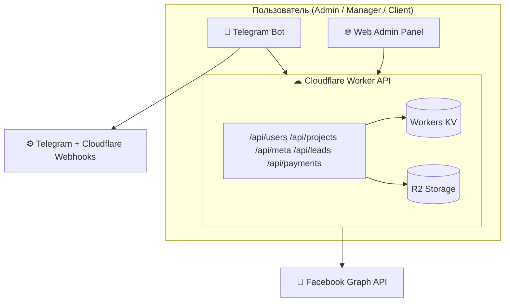
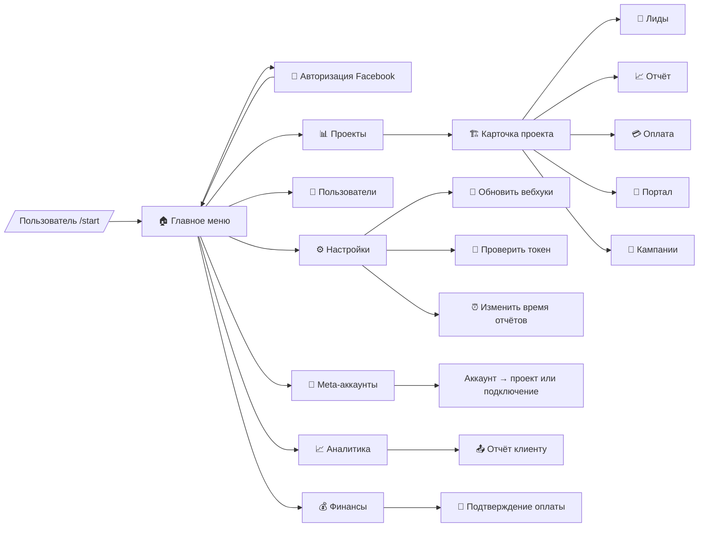

# TargetBot — единая экосистема Telegram + Web для Facebook Ads

TargetBot разворачивается на Cloudflare Workers и объединяет Telegram-бота и веб-панель над общим REST-API. Цель проекта — единое управление проектами, Meta-аккаунтами, лидами, оплатами и отчётами в реальном времени.

## Implementation Status
- [x] Итерация 1 — Настройка базовой структуры проекта и Worker API
- [x] Итерация 2 — Реализация Telegram-бота и главного меню
- [x] Итерация 3 — Добавление Facebook OAuth и токен-менеджера
- [x] Итерация 4 — Подключение Meta API, получение кампаний и расходов
- [x] Итерация 5 — Создание логики проектов, лидов и оплат
- [ ] Итерация 6 — Реализация отчётов (/auto_report, /summary)
- [ ] Итерация 7 — Вебхуки Telegram + Cloudflare
- [ ] Итерация 8 — Интеграция с веб-панелью и синхронизация KV
- [ ] Итерация 9 — Финализация FSM и inline-меню
- [ ] Итерация 10 — Тестирование, оптимизация, документация

## How to run

### Локальная разработка
```bash
npm install
npm run dev
```

### Деплой из локальной среды
```bash
npm run deploy
```

## Build / Deploy commands
```
# локально
npm install
npm run dev

# деплой
npm run deploy
```

## Архитектура

```text
src/
  api/
    meta.ts       # OAuth, статус и рекламные кабинеты Meta
    projects.ts   # CRUD проектов и привязки
    leads.ts      # Приём лидов и смена статусов
    users.ts      # Управление пользователями
    payments.ts   # Учёт оплат и статусов биллинга
    reports.ts    # Метаданные отчётов и экспортов
    settings.ts   # Глобальные настройки, расписания, локализация
    manage.ts     # Сервисные действия (переподключение вебхуков Telegram)
  admin/
    index.ts      # Панель /admin
    project-form.ts
    users.ts
  bot/
    context.ts    # Построение BotContext из обновления Telegram
    menu.ts       # Основное меню и заглушки команд
    router.ts     # Обработка вебхука Telegram
    types.ts
  components/
    layout.ts
  utils/
    http.ts       # Формирование ответов
    ids.ts        # Генерация идентификаторов
    meta.ts       # Клиент Graph API
    projects.ts   # Агрегация и сортировка статистики
    storage.ts    # Обёртки над KV/R2 для сущностей
    telegram.ts   # Отправка сообщений и работа с API Telegram
  views/
    portal.ts     # Клиентский портал проекта
  index.ts        # Маршрутизатор Worker’а
```

### Потоки данных


### FSM Telegram-бота


## Unified API (перечень конечных точек)

| Модуль | Конечные точки | Описание |
| ------ | -------------- | -------- |
| Meta | `GET /api/meta/status`, `GET /api/meta/adaccounts`, `GET /api/meta/campaigns`, `GET /api/meta/oauth/start`, `GET /api/meta/oauth/callback`, `POST /api/meta/refresh` | OAuth, выбор кабинетов и метрики кампаний |
| Projects | `GET/POST /api/projects`, `GET/PATCH/DELETE /api/projects/:id`, `GET /api/projects/:id/leads` | CRUD проектов и привязки |
| Leads | `POST /api/leads`, `GET /api/leads?projectId=`, `PATCH /api/leads/:id` | Приём и обработка лидов |
| Users | `GET/POST /api/users`, `PATCH/DELETE /api/users/:id` | Управление пользователями и ролями |
| Payments | `GET/POST /api/payments`, `PATCH/DELETE /api/payments/:id` | Учёт оплат, статусы, биллинг |
| Reports | `GET/POST /api/reports`, `GET/DELETE /api/reports/:id` | Регистрация отчётов и файлов экспорта |
| Settings | `GET /api/settings`, `POST /api/settings`, `PATCH /api/settings`, `GET /api/settings/:key` | Расписания, локализация, вебхуки |
| Manage | `GET /manage/telegram/webhook?action=refresh&drop=1` | Переподключение вебхуков Telegram |
| Telegram | `POST /bot/webhook` | Вебхук бота, роутинг команд |

## Хранилища

- **Workers KV** — long-lived токен Meta (`meta:token`) и служебные записи.
- **R2** — JSON-индексы для проектов, лидов, пользователей, оплат, отчётов и логов команд.
- `appendCommandLog` сохраняет до 500 последних действий Telegram/веб-панели.

## Telegram & Web синхронизация

- `/bot/webhook` приводит входящие апдейты к `BotContext`, разворачивает главное меню и обрабатывает разделы Telegram-бота (итерация 2).
- `/manage/telegram/webhook` пересоздаёт вебхук Telegram с учётом параметров `action` и `drop`.
- `settings.ts` фиксирует настройки автоотчётов, языков и форматов уведомлений, синхронизируя их между ботом и веб-панелью.

## Progress Log

### Progress 1
Что сделано: создана базовая структура API (payments, reports, settings, manage), добавлен маршрутизатор Telegram вебхука и обновлён Worker-роутер. Что дальше: реализовать полноценное главное меню бота и пользовательские сценарии (Итерация 2).

### ✅ Итерация 1 завершена
Настроена инфраструктура Worker API, заготовки модулей платежей/отчётов/настроек и обработка Telegram вебхука. Следующая задача: Итерация 2 — реализовать главное меню Telegram-бота и начальные действия.

### Progress 2
Что сделано: реализовано главное меню Telegram-бота, команды разделов выводят данные проектов, пользователей, финансов и статуса Meta, а действия логируются. Что дальше: Итерация 3 — добавить Facebook OAuth и токен-менеджер.

### ✅ Итерация 2 завершена
Главное меню Telegram-бота показывает статус авторизации Meta, список проектов с лидами, распределение пользователей и финальную сводку, плюс добавлены ответы на нажатия и логирование команд. Следующая задача: Итерация 3 — добавить Facebook OAuth и синхронизацию токена между ботом и веб-панелью.

### Progress 3
Что сделано: подключён полноформатный OAuth-flow Facebook, токен сохраняется в KV и валидируется через Graph API, бот сообщает срок действия и список кабинетов. Что дальше: Итерация 4 — подключить Meta API для получения кампаний и расходов.

### ✅ Итерация 3 завершена
Реализована выдача ссылки авторизации из Telegram, callback синхронизирует токен, подтягивает рекламные аккаунты и отображает их в админке и боте. Следующая задача: Итерация 4 — подключить Meta API и отобразить данные по расходам.

### Progress 4
Что сделано: добавлены вызовы Meta Graph API для кампаний и расходов, админка и бот показывают текущий spend, статусы и топ-кампании, API расширено эндпоинтом `/api/meta/campaigns`. Что дальше: Итерация 5 — создать логику проектов, лидов и оплат.

### ✅ Итерация 4 завершена
Подключены метрики кампаний и расходов к Worker API, веб-панели и Telegram-боту, обеспечена синхронизация spend с таблицами кабинетов и inline-отчётами. Следующая задача: Итерация 5 — внедрить управление проектами, лидами и оплатами.

### Progress 5
Что сделано: добавлены сводные данные по оплатам в проекты и портал, внедрена страница /admin/payments с созданием и обновлением платежей, Telegram-бот показывает биллинговый статус по каждому проекту. Что дальше: Итерация 6 — реализовать отчёты и автоматические команды /auto_report и /summary.

### ✅ Итерация 5 завершена
Система проектов объединяет лиды и оплату: админка показывает статусы биллинга, портал информирует о действующем платёжном периоде, а Telegram-бот и API делятся общей сводкой. Следующая задача: Итерация 6 — реализовать отчётность и автоотправку отчётов.

### Прогресс: 5/10 итераций
Осталось: отчёты (/auto_report, /summary), расширение FSM-меню, финальные вебхуки и финтесты с документацией.
