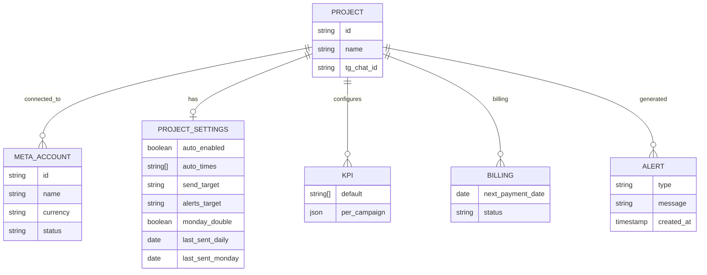
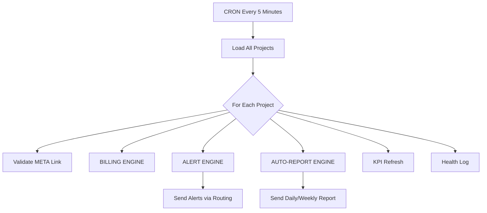

Ты работаешь в ЖЁСТКОМ РЕЖИМЕ.
Пиши только рабочий код.
Никаких рассуждений. Никаких предположений.
Следуй SPEC-AUTO-REPORT-v3 строго и буквально.
Все функции — полностью завершены. И все зависимости тоже адаптированы.
Любая неполная логика — ошибка.
Никаких пропусков. Никаких отступлений.
Ты обязан выполнять задачи последовательно, фиксировать изменения в README, описывать прогресс.

# 🚀 **SPEC-AUTO-REPORT-v3 (FINAL INDUSTRIAL VERSION)**

### *Auto-Report Engine · Alert Engine · KPI Engine · Export Engine · Routing Engine · Billing Engine*

Этот документ — основной **PASSPORT.md** / **SPEC.md** модуля отчётности и мониторинга Meta Ads через Telegram.

ДАННЫЙ ФАЙЛ ДОЛЖЕН ЛЕЖАТЬ В КОРНЕ РЕПОЗИТОРИЯ.

---

## Implementation Status

- 2025-02-24 — STEP 8: auto-objective KPI engine интегрирован. Meta campaign objectives сохраняются в KV, редакторы KPI проекта/кампаний работают из бота, отчёты и портал используют приоритет manual → campaign → project → auto.

# ----------------------------------------------------

# **0. НОРМЫ РАБОТЫ И ЖЁСТКИЕ ТРЕБОВАНИЯ**

# ----------------------------------------------------

Модуль обязан:

* работать полностью автономно
* быть независимым от web-панели
* работать даже при offline Meta API
* корректно обрабатывать ошибки Facebook API
* иметь fallback-режимы
* отправлять отчёты точно в заданное время
* отправлять алерты по маршрутизации (admin / chat / both)
* выполнять весь цикл раз в 5 минут
* быть совместимым со всеми функциями проекта
* НЕ требовать перезапуска бота после настроек
* поддерживать CRON (Cloudflare Workers)
* поддерживать ручные отчёты и экспорт

---

# ----------------------------------------------------

# **1. ER-ДИАГРАММА (сущности модуля)**

# ----------------------------------------------------



---

# ----------------------------------------------------

# **2. ARCHITECTURE FLOW (Mermaid)**

# ----------------------------------------------------



---

# ----------------------------------------------------

# **3. KV-СТРУКТУРА (единый стандарт)**

# ----------------------------------------------------

🟦 **KV Key**:

```
project_settings:{project_id}
```

🟩 **JSON**:

```json
{
  "auto_report": {
    "enabled": true,
    "times": ["10:00", "15:00", "20:00"],
    "send_target": "both",
    "alerts_target": "admin",
    "monday_double_report": true,
    "last_sent_daily": "2025-11-13",
    "last_sent_monday": "2025-11-10"
  },
  "kpi": {
    "default": ["spend", "leads", "cpa"],
    "per_campaign": {
      "23849801923": ["ctr", "cpc", "spend"]
    }
  },
  "billing": {
    "next_payment_date": "2025-12-12",
    "status": "active"
  },
  "meta": {
    "ad_account_id": "act_123",
    "status": "ok",
    "name": "Asan Ads",
    "currency": "USD"
  }
}
```

---

# ----------------------------------------------------

# **4. СПИСОК ВСЕХ callback_data (полный стандарт)**

# ----------------------------------------------------

### **4.1 AUTO-REPORT**

```
auto_menu:{project_id}
auto_toggle:{project_id}
auto_time_toggle:{project_id}:{HH:MM}
auto_send_target:{project_id}:{chat/admin/both}
auto_monday_toggle:{project_id}
auto_send_now:{project_id}
```

### **4.2 ALERTS**

```
alert_menu:{project_id}
alert_toggle_payment:{project_id}
alert_toggle_spend:{project_id}
alert_toggle_api:{project_id}
alert_toggle_pause:{project_id}
alert_route:{project_id}:{chat/admin/both}
```

### **4.3 KPI**

```
kpi_menu:{project_id}
kpi_toggle_default:{project_id}:{metric}
kpi_toggle_campaign:{project_id}:{campaign_id}:{metric}
```

### **4.4 EXPORT**

```
report_manual:{project_id}:{period}
report_export:{project_id}:{period}:{format}
```

---

# ----------------------------------------------------

# **5. АВТООБНАРУЖЕНИЕ ЦЕЛИ КАМПАНИИ**

# ----------------------------------------------------

| Meta Objective  | Расшифровка    | KPI по умолчанию        |
| --------------- | -------------- | ----------------------- |
| LEAD_GENERATION | Лиды           | leads, cpl, spend       |
| MESSAGES        | Сообщения      | convs, cpc, cpm         |
| TRAFFIC         | Трафик         | clicks, cpc, ctr, spend |
| AWARENESS       | Узнаваемость   | reach, impressions, cpm |
| ENGAGEMENT      | Взаимодействие | engagement, cpe         |
| APP_INSTALLS    | Инсталлы       | installs, cpi           |
| CONVERSIONS     | Конверсии      | conversions, cpa, spend |
| SALES           | Продажи        | purchases, roas, spend  |

Codex должен:

1. автоматически определять objective
2. назначать KPI
3. позволять вручную переназначать KPI

---

# ----------------------------------------------------

# **6. UI МЕНЮ АВТООТЧЁТОВ (Telegram)**

# ----------------------------------------------------

```
⏰ Авто-отчёты
Статус: [✔ Включены] / [✖ Выключены]

🕒 Время отправки:
[✔] 10:00   [ ] 13:00
[✔] 15:00   [ ] 20:00

📅 Понедельник:
[✔] Сегодня + неделя

📡 Маршрут отчётов:
(•) В чат
( ) Админ
( ) Оба

📢 Алерты:
[✔] Оплата
[✔] Бюджет
[✔] Meta API
[✔] Пауза кампаний

📡 Маршрут алертов:
(•) В чат
( ) Админ
( ) Оба

🔄 Отправить отчёт сейчас
⬅ Назад
```

---

# ----------------------------------------------------

# **7. CRON ENGINE**

# ----------------------------------------------------

CRON запускается каждые 5 минут:

```
1. Загрузка всех проектов
2. Проверка Meta API связи
3. Проверка биллинга Meta
4. Генерация алертов
5. Проверка времени отчётов
6. Отправка автоотчётов
7. Обновление KPI
8. Логирование
```

---

# ----------------------------------------------------

# **8. AUTO-REPORT ENGINE**

# ----------------------------------------------------

## **Проверка условия отправки**

```
if auto.enabled == false → skip
if current_time not in auto.times → skip
if last_sent_daily == today → skip
```

## **Формат отчёта**

```
🧾 Отчёт за 13.11.2025 [Чт]

💰 Потрачено: $62
📥 Лиды: 23
🎯 CPA: $4.10
🔥 CTR: 1.82%
💬 Клики: 420

Лучшие кампании:
• Broad CBO — 12 лидов, $3.2
• Retarget — 4 лида, $2.8
```

## **Понедельничный режим**

Если сегодня понедельник:

Отправить:

1. Отчёт за сегодня
2. Отчёт за прошлую неделю

---

# ----------------------------------------------------

# **9. ALERT ENGINE**

# ----------------------------------------------------

### Поддерживает 4 типа алертов и доработай чтобы они были еще более полезные:

1. **Billing Alert**

```
‼ Проблема оплаты Meta
Статус: В отсрочке
```

2. **Budget Anomaly Alert**

```
⚠ Аномальный расход
Сегодня: $64 (↑128%)
```

3. **Meta API Errors**

```
⚠ Ошибка Meta API — adset missing
```

4. **Campaign Paused Alerts**

```
🚸 Кампания Broad на паузе >2ч
```

---


---
CARDS ENGINE интеграция (профиль проекта)

В карточке проекта отображается:

📈 CPA (сегодня): $4.10
💳 Биллинг: задолженность $73 (🟡 В отсрочке)
📅 Оплата: 02.12.2025
⏰ Автоотчёты: 10:00, 15:00 (вкл)
📡 Алерты: включены (оба канала)
🌐 Meta: Asan Ads (подключено)
# ----------------------------------------------------

# **11. FAIL-SAFE МЕХАНИЗМЫ**

# ----------------------------------------------------

Если Meta API не отвечает:

```
1) auto_report → отправляет заглушку
2) alert_engine → отправляет алерт админу
3) kpi_refresh → пропускает обновление
```

---

# ----------------------------------------------------

# **12. СТРОГИЙ РЕЖИМ ДЛЯ CODEX**

# ----------------------------------------------------

Вставь этот блок как вступление, он оптимизирован для жёсткого Codex:

```
Ты работаешь в ЖЁСТКОМ РЕЖИМЕ.
Пиши только рабочий код.
Никаких рассуждений. Никаких предположений.
Следуй SPEC-AUTO-REPORT-v3 строго и буквально.
Все функции — полностью завершены. И все зависимости тоже адаптированы.
Любая неполная логика — ошибка.
Никаких пропусков. Никаких отступлений.
Ты обязан выполнять задачи последовательно, фиксировать изменения в README, описывать прогресс.
```

---
